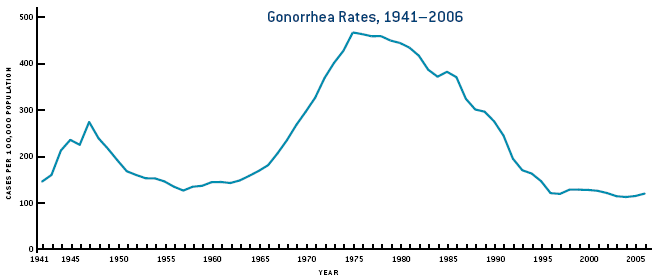

# Patterns of Infectious Disease Dynamics

## Overview and Learning Objectives
In this module, we will discuss different patterns of ID dynamics, such as single outbreaks, recurrent cycles, and steady endemic states. 

The learning objectives for this chapter are:

*    Understand the concept of resource replenishment
*    Know the different mechanisms that can lead to ID cycles
*    Understand the concept of endemic state
* Understand what leads to different ID patterns 
* Understand the difference between intrinsic and extrinsic drivers of ID cycles


## Introduction
Different IDs show different patterns in their dynamics. Some IDs produce sporadic outbreaks and then seem to disappear for years. Ebola is a prominent example. Other ID seem to be 'always around' and incidence or prevalence might change little. TB and HIV in some parts of the world, as well as certain STD and chronic viral infections show such patterns. Many other IDs show oscillatory behavior, i.e. we repeated outbreaks or increases in incidence, followed by periods of reduced incidence. For some ID, these patterns of increase and decrease are annual, for other ID the cycles are multi-year. Figure \@ref(fig:IDcycles) shows an example of such patterns of increase and decrease for measles and pertussis.

```{r IDcycles,   fig.cap='Examples of ID cycles. From [@keeling08].',  echo=FALSE}
knitr::include_graphics("./images/IDcycles.png")
```

Understanding the nature of the different patterns seen for ID help understand the general 'behavior' of the ID and can also point to best approaches of minimizing specific IDs.


## Resource Replenishment
The basic SIR model considered in chapter \@ref(idintro) can capture the dynamics of a single outbreak, it can however not reprduce repeat oscillations or endemic states. The reason for this inability of the simple model to produce more than one outbreak is because as the ID spreads, it depletes the pool of susceptibles. At then end of the outbreak, there are not enough susceptible individuals left to allow for a second outbreak or an endemic state. In ecological terms, the infectious disease depleted its resources (i.e. its hosts) and subsequently dies out. This is a very general principle: We see that in predators consuming prey, forest fires consuming trees, and pathogens "consuming" their susceptible hosts. If the resources are not replenished quickly enough, the consumer of these resources will go extinct. To sustain the continued presence of the consumer/predator, resources need to be replenished. 

For our scenario, the resource consumer is the ID, and the resources are the susceptible hosts, usually humans. To sustain endemic states or repeat increases in incidence, susceptible hosts need to be entering the system. This can happen through different mechanisms. The most common processes to add new susceptibles to a population is through the birth of new, susceptible individuals, or through the loss of immunity, and return to the susceptible class, of existing hosts. Migration, if strong, can be another way susceptible hosts can be replenished. Similarly, individuals that become newly sexually active correspond to the birth of new susceptibles for sexually transmitted infections. 

If the replenishment of new susceptibles is fast enough to balance the depletion of resources by the ID, an ID might be able to maintain itself in a population and lead to either oscillatory patterns or an endemic state.


## A Model with Resource Replenishment 
A version of the SIR model that includes resource replenishment through natural births or waning immunity is shown in figure 
\@ref(fig:birthdeathdmodel). 

```{r birthdeathdmodel,  fig.cap='Example of an SIR model with births, deaths and waning immunity.',  echo=FALSE}
knitr::include_graphics("./images/R0modelfigure.png")
```

The new features of this model compared to the basic SIR model introduced earlier are births (of susceptibles) at some rate _m_, and the possibility that recovered lose their immunity and return to the susceptible class at rate _w_. Both of these processes can produce new susceptibles and thus lead to resource replenishment. If this process is fast enough, it can allow the ID to persist and lead to oscillations/cycles or steady states.

#### Notes {#mynotebox}
The model shown in \@ref(fig:birthdeathdmodel) also includes natural death at rate _n_. This is done to for several reasons. One is simply consistency. If we make the model more detailed by taking into account natural births, it seems reasonable to also include natural death. Another, related reason is that without death in the model to balance births, we would have a population which grows without bounds. This is not a good approximation of any real scenario. When you implement models, especially larger ones, you always want to make sure that each component of the model produces reasonable results by itself. In this example, in the absence of disease, we would like to have susceptible individuals reach some steady level depending on births and deaths. Without the inclusion of the death rates, this could not happen.


#### Mathematical Equations for the Model with Resource replenishment {#myadvancedbox}
The ordinary differential equations corresponding to the compartmental model shown in figure \@ref(fig:birthdeathdmodel) are given by

$$\dot S = m - b I S + wR - n S $$ 
$$\dot I = b IS - gI - n I $$ 
$$\dot R =  gI - wR - n R$$


## Intrinisic Cycles 
The interaction between susceptible and infectious hosts can lead to a dynamical pattern that can/does produce oscillations. Specifically, the dynamics of resource consumption (depletion of susceptible hosts), waning ID incidence due to reduced availability of hosts, and subsequent replenishment of susceptibles can lead to cycles. Since these cycles are not driven by anything "from the outside" and arise purely due to the complex interplay between host resources and ID, there are sometimes called intrinsic cycles/oscillations. The timing of these cycles (the period of the oscillations) is determined by characteristics of the ID and scenario. For instance, the duration of the infectious period and the transmissibility of the host influence the timing of outbreaks. In ecology, such cycles are well studied in the context of so-called predator-prey systems. For our infectious disease models, the "prey" are the susceptibles and the "predators" are the infected individuals.


## Intrinisic Cycles and models 
One can sometimes compute the time between outbreaks. For the simple compartmental SIR model, an approximate equation for the period close to the endemic state is 
$$T \approx 2 \pi \sqrt{\left( \frac{LD}{R_0 - 1} \right)}$$

Here, _L_ is the average lifespan of a host, _D_ is the average duration of infectiousness, and _R~0~_ is the basic reproductive number - a quantity we will discuss in chapter \@ref(R0) For more details on this equations, see e.g. [@keeling08].

For more complicated models and real-world scenarios where the simple SIR model is not a good approximation, the equation just provided does not apply anymore. It might not even be possible to write down any equation. One can then instead run a computer simulation of the model and determine the length of the cycles from the time-series returned by the computer. The main point still holds, independent of the ability to write down an equation for the cycle length, namely that there is a relation between intrinsic characteristics of the system, such as duration of infectious period (_D_) and transmissibility of the disease (_R~0~_), and the period of the oscillations. In cases where we cannot derive a mathematical equation, we can try to figure out the relation between cycle duration and some parameter of interest. This can be achieved by repeatedly altering the parameter (e.g. the duration of the infectious period, _D_), and recording the cycle period, _T_, reported by the model simulation for various values of the parameter. By plotting a figure showing _D_ on the x-axis and _T_ on the y-axis, we obtain a relation between these quantities. 


## External Drivers of Cycles
Another mechanism that can lead to oscillations in the dynamics of ID can come from "external" drivers. Of course, these processes are still part of the whole system, but not as directly as the dynamics and interaction of the hosts. In that sense, we consider it an external process. 

Weather is one of the most important external factors. Many IDs are influenced by the weather. For instance influenza virus survives better when the vapor pressure is low, which in temperate regions is usually the case in winter [@lipsitch09, @shaman10]. 

Other types of seasonality are related to human activity and behavior. For instance, many childhood diseases increase in incidence when a new school year starts. 

For some ID, weather and behavior interact. Many water-borne diseases in the U.S. see an uptick in summer. This is due to behavior changes in the host: More people swim in outdoor water in the summer. 

Often, more than one mechanism occurs and influences the ID dynamics. As such, it is often not possible to isolate a single factor as the main important one. It often depends on the particular setting.


#### Notes {#mynotebox}
In the type of models we have looked at so far, seasonality or some other external driver is needed to sustain oscillations. Without it, the cycles die out, and the disease reaches a steady, endemic state. For more complex models or models that include stochastic dynamics (discuss in chapter \@ref(stochastic)), cycles can be maintained even in the absence of external drivers.


## Steady states
In addition to single outbreaks or recurrent cycles, ID often also reach a state where the prevalence in a population is roughly constant. This is usually referred to as an endemic state. Examples of that are e.g. helminth infections in many African countries (in the absence of control efforts) or certain sexually transmitted diseases in developed countries. 

At steady state, the total number of ID cases (the prevalence) does not change. Nevertheless, it is important to keep in mind that there are still constantly new cases occuring, i.e. the incidence is not zero. It just happens to be the case that the incidence is roughly similar to the rate at which existing cases disappear (e.g. through recovery or death), such that the turnover process is in balance, leading to a a roughly constant prevalence.


If we have a mathematical or computer model of our system, there are two ways to determine steady states. One is mathematical, and the other is through simulating the system. The former approach is more elegant and powerful but only works if we have a relatively small model. It is illustrated in the box below. Often, the model is too complicated to obtain useful equations for the steady state values of the model variables. Fortunately, we can always determine them numerically. We simply start our computer simulation model with some values and run it long enough until it has settled down (we need to make sure it does have a steady state). We can then record the steady state values. We can do this for different model parameter values (e.g. changes in birth rate or changes of rate of infection). In the end, we can plot a figure showing how the steady state values change with some model parameter. This approach is obviously much slower than using the mathematical equations. However, often it is the only feasible approach. 

Note that there are technically steady states that exist but won't show up in the simulation since they are unstable. Since any unstable steady state also rarely exists in nature (other than the disease free state, with a population remaining in that state until a new pathogen arrives), those steady states tend to be not that important in practice.


#### Steady States and Models {#myadvancedbox}
When an ID reaches a steady state, a model based on ordinary differential equations, such as the model shown above, simplifies. At steady state, there are -- by definition -- no changes in the total number of individuals in each compartment. Therefore the left side of the equations are zero, i.e. $\dot S = \dot I = \dot R =0$. This changes the differential equations into a set of algebraic equations. For a fairly small set of equations (usually < 5), one can obtain equations for the compartments (_S_, _I_, and _R_ in this case) at steady state that are a function of the model parameters. While it is often theoretically possible to solve models with more compartments/equations, the resulting expressions are usually so big and unwieldy to not provide much useful insight.

The hard method of solving this set of equations is with pen and paper. Nowadays, there is software that can do it for you. The two most important packages for such tasks are [Maple](http://www.maplesoft.com/) and [Mathematica](https://www.wolfram.com/mathematica/). Both are commercial products, fairly powerful and quite expensive. If you only need a program for occasionally solving such equations, free alternatives are available. I usually use [Maxima](http://maxima.sourceforge.net/).  [Other packages exist](http://en.wikipedia.org/wiki/Comparison_of_computer_algebra_systems). Note that `R` is not suitable for solving symbolic equations. Using Maxima to solve the equations above (without immune recovery, i.e. _w=0_, to make the results simpler) gives:


```{r SSmaxima,   fig.cap='Maxima code for solving the SIR model steady state equations.',  echo=FALSE}
knitr::include_graphics("./images/SSmaxima.png")
```


The same results are of course obtained when solving the equations by hand. The first steady state returned by maxima is the one in the absence of an ID, with only susceptibles around. Usually, we are interested in the second steady state, the endemic equilibrium at which disease prevalence is at a fixed level. We thus find the values for the number of susceptible, infected and recovered at steady state as a function of the model parameters.

Having the equations for the steady state allows us to gain insight into the system behavior rapidly. For instance we can see that for an endemic steady state to be possible (i.e. for _I_ > 0 at steady state), we need $b m >  n (n+ g)$. We can make intuitive sense out of this expression: The combination of pathogen transmission capacity (_b_) and birth rate _m_, which support ID persistence, needs to be stronger than the effects of general host death _n_ and host recovery _g_. We will later see that this relates to the concept of reproductive number.


## Detecting cycles or other patterns
It is often hard to determine if there is a specific repeating pattern, such as oscillations/cycles for a given ID. Consider for instance Figure \@ref(fig:gonorrheapattern) ([Source CDC](http://www.cdc.gov/STD/stats06/images/trends-img-2.gif)). 
One can see that Gonorrhea incidence was fairly stable between 1950-1965 and again 1995-2005, with ups and downs in between. The changes are not rapid enough to be due to seasonal/annual drivers. If we had more data and the same up-down pattern repeated, we could speculate that this might be due to some intrinsic oscillatory dynamics of the disease. In this case, the most likely explanation for the observed patterns lies outside the disease dynamics itself. Increased detection and treatment likely led to a decline in the 40s, changing sexual behavior lead to an increase starting in the 60s, and strong safe-sex campaigns, combined with the threat of HIV, resulted in a decrease starting in the 80s. However, this is somewhat speculative. It might well be that other factors, (e.g. changes in surveillance intensity) could explain the pattern. A careful analysis (which I have not done) would be needed before one can be more confident as to what might lead to the observed pattern.


```{r gonorrheapattern, fig.cap='Gonorrhea cases in the US.',  echo=FALSE}

```


## ID Dynamics in Changing Populations
The idea of resource replenishment described above assumes in its simplest forms that in the absence of the ID, the host population is in steady state. That is, the number of births and deaths balance each other, and the population size, therefore, stays constant. We then investigate ID dynamics on top of such a constant population (which then might not be constant anymore if the disease leads to many deaths).

One can go a step further and consider an underlying population that changes in size due to underlying growth or decline of the population. We can then study the dynamics of an ID on top of an already dynamically changing population. While this is not much more complicated to do with computer models, it is harder to understand what exactly is going on in the system. For instance, consider an ID with high mortality in a growing population. If we just looked at the population size, it could be that it remains constant, due to the two processes of natural population growth and disease induced mortality balancing each other. We, therefore, need to study how the different processes affect ID dynamics carefully.


## Summary and Cartoon
This module provided a discussion of the various general patterns we observe in the dynamics of ID. Those are individual outbreaks, cycles of repeated outbreaks, and steady endemic states. 


```{r sciencenewscycle,   fig.cap='Here is a different kind of cycle that (ID) scientists sometimes encounter. [Source: phdcomics.com](http://www.phdcomics.com/comics/archive.php?comicid=1174).',  echo=FALSE}
knitr::include_graphics("./images/phd_sciencenewscycle.png")
```


## Exercises
* The _Patterns of ID_ app in the DSAIDE package provides hands-on computer exercises for this chapter.
* Find a scientific article/paper that investigates the incidence/prevalence pattern of some ID. Summarize the article. Discuss why one sees the observed pattern (and not one of the others). Speculate what kind of change to the ID/system could change the observed pattern (even if that change is not biologically realistic).
* Read the article "Dynamical resonance can account for seasonality of influenza epidemics" by Dushoff et al [@dushoff04]. They suggest an interesting explanation for the seasonal variation in influenza cases. Look at the literature to see if since that paper came out, there has been any further progress on that question. Discuss recent advances that might support or refute the idea suggested by Dushoff et al.

## Further Resources
* The following references provide some more information on and discussion of seasonality in IDs: [@altizer06; @dowell01; @grassly06; @stone07].
* Seasonality for influenza has been heavily studied, some references are [@dushoff04; @lofgren07; @baumgartner12]. 
* A discussion of cycles in Cholera can be found in [@pascual02; @emch08].


## References
