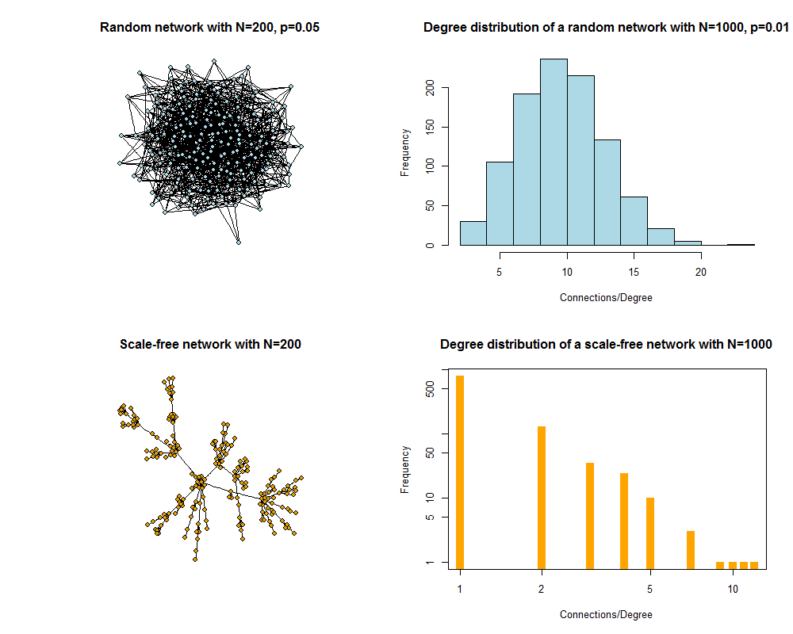

#Networks and ID

##Overview
In this module, we will briefly discuss the concept of transmission networks and how that affects ID dynamics and control.

##Introduction
ID spread along _connections_ between infected and uninfected hosts. Those could be very close and clearly defined connections, such as for sexually transmitted infections, or much less well defined connections, such as a shared water or air source (e.g. cholera and influenza). If we want to explicitly account for these connections, we need to consider a conceptual framework that moves away from the compartmental approach. In the compartmental approach, all hosts with given characteristics (e.g. infected children) were lumped together and no notion of connectivity was included. In contrast, a network perspective explicitly considers individuals and their connections. 

##Network terminology
The basic building blocks of networks are entities and their connections. Those entities go by different, equivalent names, such as actor, node, vertex, site. Similarly, the connections have different, equivalent names, such as edge, link, bond, tie or connection. The different names stem from the fact that network ideas were developed independently in different scientific sub-fields.

##Network nodes
Usually, the nodes are individual hosts (e.g. humans). But that does not need to be the case, nodes can also represent entities such as schools, cities, hospitals, etc. Simple networks only have one type of node, more complicated networks can have different types of nodes. For instance humans can be connected to specific places where they meet.

In their simplest form, nodes are only characterized by their connections, they don't have any other properties. In model simulations, it is possible to give nodes features such as age, gender, etc. and account for that when simulating ID spread.

##Network connections
What constitutes a connection in a network strongly depends on the question asked and the ID under consideration. Sexual networks connect people that have some form of sexual contact that suffices to transmit the disease in question. Similarly, social contact networks consider contacts between people in a social setting that allows for transmission of an ID, e.g. close contact for transmission of a respiratory disease. Proximity networks can be built based on people frequenting the same locations. Connections can either just 'exist' or not, or they can have characteristics, similary to nodes. For instance connections can have weights, with stronger connections between people that have closer or longer contacts. Connections can also have directions. For instance if we wanted to model cholera transmission and had a network of villages, then a village upstream would have a connection pointing to villages downstream, but not the reverse. In other words, an 'infected village' upstream can infect a downstream village, but the opposite does not occur.

##Network characteristics
The initial study of a network often starts with the properties of the network itself, without considering any ID spread (yet). One of the most important characteristics of a network is the degree distribution of the nodes. This is simply a histogram of the number of connections that each node has. If connections have directions or there is more than one type of connection possible, then each one would have its own histogram. 

Another network characteristic is the 'shortest path length', which measures the shortest distance of going from a specific node to some other node. Every node has a shortest path length to every other node (if 2 nodes are not connected because they belong to unconnected subparts of a network, the path length is considered infinite).

Many other network characteristics exist, the field of network analysis has grown rapidly in the last several years. If you want to learn more, [@newman13] is a good resource. Many review articles on that topic also exist, e.g. [@keeling05]. 

It is important to understand that some characteristics are attached to individual nodes and some to the full network. For instance every node has a number of degrees (connections) and the network has an overall degree distribution. Similarly, one can compute the mean shortest path length for each node and, if one takes another mean, a mean path length  for the whole network. 

##Important types of networks
There are several types or classes of networks with specific characteristics that have been studied in great detail, either because they are analytically tractable or because of their real world importance.

One of the best-studied network is the random network. In this network, any 2 nodes have a fixed probability of being connected. For a network of _N_ nodes and connection probability _p_, the average number of connections each node has (i.e. it's degree) is _(N-1)p_. The degree distribution of the network is binomial, which for large networks becomes a normal distribution. That means most nodes have approximately the average number of connections, there are only few nodes with substantially fewer or more connections.

Many real-world networks do not have the degree distribution found for random networks. It is often common that most nodes have very few connections, while a few nodes have many connections. This idea for instance underlies the superspreader concept. Such a distribution of connections can be well described by a scale-free network, here, the degree distribution follows a power law, with most nodes having very few connections but a small number of nodes having very many connections.

##ID transmission on networks
The premise for ID transmission is that it can only occur along the connections of a network. As such, the structure of the network can strongly influence the dynamics of the ID. How exactly different characteristics of networks, such as the one discussed above and others, interact with the characteristics of the ID to affect overall ID dynamics is an area that is currently heavily investigated. For some recent work on that, see e.g. [@bansal07]. 

##Networks and ID control
Knowing about the connection structure is important for ID control. Most obviously, if we know who the individuals are with many connections, we could target them preferrentially and have a potentially larger impact compared to targeting random individuals. Other individuals, e.g. those that connect separate clusters of a network, might also be prime targets. The challenge in real world systems is to identify the individuals that should be targeted and being able to reach them - and in an outbreak situation, that would need to be done under time pressure. As such, while network theory has much to offer for control, it is still challenging to implement network-based intervention approaches in practice.

##Modeling ID transmission on networks
Building and analyzing network models of ID transmission is generally more challenging than the compartmental modeling approach. For networks, we usually track individuals. As such the models become what are called individual or agent-based models. We need to keep track and simulate the dynamics of each individual. That makes coding harder and running the models much more computationally resource intensive. It is also somewhat harder to analyze the results. Still, networks are much closer to many real systems and have therefore seen increased use in the ID modeling community in recent years. With an increase in available data of the 'network type' (e.g. geocoded cellphone data), further increase in computational power and more sophisticated and efficient analysis approaches, it is quite likely that network-based approaches will continue to grow in importance.

##ID transmission on dynamic networks
Most of the time, networks are considered static and do not change during the ID transmission process. However, this does not have to be the case and is often not realistic. The most detailed models allow for changes in the network through the making and breaking of connections and addition and loss (e.g. birth and death) of nodes. Implementing and analyzing models that have a dynamically changing network with the ID dynamics (and potential control measures) occuring 'on top' is technically challenging. Not too many of such models currently exist, but it is an area of active investigation by many, see e.g. [@bansal10].

##Summary

##Exercises
* The 

## Further Resources

##References

