--- 
title: "Infectious Disease Epidemiology - a Model-based Approach (IDEMA)"
author: "Andreas Handel"
date: "2020-08-24"
bibliography: idemabook_references.bib
biblio-style: apalike
link-citations: yes
description: "A modern, model-based approach to infectious disease epidemiology"
site: bookdown::bookdown_site
delete_merged_file: true
language:
  ui:
    chapter_name: "Chapter "
output_dir: "docs"
output: 
    bookdown::gitbook:
        highlight: zenburn
        css: ./idemabook.css
        fig_caption: true
        keep_md: true
        config:
            toc:
              collapse: none
            toolbar:
              position: fixed
            edit: null
            download: ["IDEMAbook.pdf"]
    bookdown::pdf_book:
        keep_tex: no
        toc: true
documentclass: book
---

# Preface {-}

This book discusses infectious disease epidemiology using a model-based approach.

__Note 1: This book is a continuous work in progress. I will likely be moving material around, adding new chapters, combining existing ones, and adding more content. I don't expect to delete major parts, but rewrites and reshuffling are expected to keep happening. So if something you read previously is 'gone', it got likely moved to a different chapter/section of the book__  

Note 2: I appreciate receiving feedback. If you think a certain topic is missing that should be covered, or certain topics aren't explained well, or any other thought you have, please provide feedback. The best way of doing so is by going to [the github page for this book](https://github.com/andreashandel/IDEMAbook) and submitting an "Issue". Alternatively, feel free to email me (google me to get my email address).

<!--chapter:end:index.Rmd-->

# Overview of this book

This book discusses infectious disease epidemiology by taking a model-based approach.

## Rationale for this book
Infectious disease epidemiology is the oldest area of epidemiology and public health. As such, it is well studied, often taught, and good resources exist. So why another book on that topic?

There are plenty of infectious disease epidemiology books that cover the topic from a classical epidemiological perspective. However, such an approach often ignores or minimizes the importance of interactions and is not suited to covering topics such as disease extinction and emergence, oscillations and other patterns, and any topic that requires considering a system of interacting elements. The well-developed field of infectious disease modeling has its main focus on studying the interactions and resulting dynamics of ID. Good text books exist, such as [@anderson91; @diekmann00; @keeling08; @vynnycky10; @bjornstad18], but require a strong quantitative and mathematical background from the student.

This book is intended to fill the gap between classical infectious disease epidemiology books and infectious disease modeling books. Infectious disease topics are discussed from a model-based perspective, but without trying to teach modeling. 
We believe any modern infectious disease epidemiologist needs to have some familiarity with models, and as such, this book contains models and equations. But this material is not meant to teach you how to become a modeler. Instead the focus is on understanding the modeling perspective and becoming an _educated consumer_ of models.

## What this book does and does not cover
This book does not teach basic concepts of epidemiology. I assume readers are familiar with basic ideas such as incidence and prevalence, study designs such as cohort and case-control studies and clinical trials, and other basic epidemiological concepts. For readers unfamiliar with these ideas, we suggest e.g. [@giesecke17].

This book does not teach much about specific infectious diseases. While many different infectious diseases appear in this book, the goal is not to describe any one in much detail. Instead, they appear as examples of general dynamical patterns and concepts the book covers. For information on the epidemiology of specific infectious diseases, see e.g. [@nelson13].

Finally, while this book takes a modeling perspective, it does not intend to teach modeling. For anyone interested in learning how to build and analyze their own infectious disease models - a skill we highly recommend learning - we suggest e.g. [@keeling08; @vynnycky10].

Maybe the material closest in approach to this book is not another book but the online course ["Epidemics"](https://www.coursera.org/learn/epidemics) developed and taught by multiple faculty members at Penn State University, or the course by the same name [offered by The University of Hong Kong](https://www.coursera.org/learn/hkuepidemics).

## How to use this book
Each chapter deals with a different topic concerning infectious diseases and their dynamics at the population level. While I assume that you go through the text linearly, and therefore occasionally reference topics discussed in previous chapters, it is likely possible to read the chapters out of order and as needed refer to previous sections to the book if they are mentioned.

The idea is that this material can be learned without the need to rely on advanced mathematics or computer modeling. That said, this book still contains models and equations. In the case where this material is advanced, it is placed in a special text box. It is possible to skip over those boxes and still follow everything else. 

## Computer exercises
Modern infectious disease epidemiology is inherently computational. While this book does not assume knowledge of or teach modeling, models feature prominently in this book. As a complement to this book, I wrote a user-friendly R package, [DSAIDE](https://ahgroup.github.io/DSAIDE/), which allows you to explore the topics discussed in this book through hands-on computer exercises. These computer exercises and the use of the DSAIDE package do not require coding skills. At the end of each chapter, I mention which simulation/app from the DSAIDE package corresponds to the material covered in the chapter. For more on the DSAIDE package and how to install it and get started [check out the package website](https://ahgroup.github.io/DSAIDE/).

## Recommended complementary resources
Each chapter of the book lists additional resources. As overall supplements to this book, I specifically recommend the following resources:

* The two "Epidemics" online courses mentioned above.
* For additional information on infectious disease epidemiology from a more traditional, medical perspective, the very detailed book "Infectious Disease Epidemiology" is a good reference [@nelson13].
* For those who want to continue learning about infectious diseases and modeling with the goal to become modelers, I recommend "Modeling Infectious Diseases in Humans and Animals" [@keeling08] and "An Introduction to Infectious Disease Modelling" [@vynnycky10].

## References

<!--chapter:end:05-BookOverview.Rmd-->

# Introduction to the Dynamical Systems Approach {#idintro}

## Overview and Learning Objectives
In this chapter, we discuss the idea of taking a _dynamical systems approach_ and how it is applied to infectious diseases.

The learning objectives for this chapter are:

* Understand the basic ideas of complex systems and systems thinking
* Understand how models can help study complex systems
* Assess strength and weaknesses of different modeling approaches 
* Understand the concept of a compartmental model and how it can be used to model infectious diseases

## Introduction 
The scientific approach that has generally been the most successful in the past was to break down a system into its components and study the components one at a time. This is commonly referred to as the *reductionistic approach*. This approach to understanding the world is still very powerful and useful. 

A complementary approach, which has seen increased use, is to look at all components of a given system at once, instead of each component by itself. Using the whole system approach can provide insights that might not be obtained by the purely reductionist approach. Looking at the whole system at once is often referred to as _systems thinking/approach_.

While the terminology of _systems thinking_ or _systems approach_ has seen increased use in the last few decades, the general idea has been around for a while. The notion of systems is present in virtually every field of research, ranging from the hard sciences to social sciences and business. In public health, there is the basic idea - most often applied to infectious diseases - of the *agent - host - environment* system, also referred to as the _epidemiological triangle_ (Figure \@ref(fig:epitriangle)). 

(\#fig:epitriangle)A system perspective - The epidemiological triangle

## Systems Thinking
The term _systems thinking_ or _systems approach_ is not a very clearly defined term, but in general, a _systems_ perspective looks at multiple - often many - components that interact with each other in potentially complicated ways. 

For instance, the problem of obesity has many different components that interact in potentially complex ways to affect a person's weight. Figure \@ref(fig:obesitysystem) illustrates this, see also for instance [this video](https://youtu.be/2vojPksdbtI). Complex systems are everywhere. The approach of studying (most of) the system at once instead of looking at a single component at a time is the hallmark of the _systems approach_. 

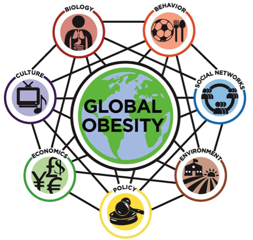

(\#fig:obesitysystem)Obesity as a complex system: http://goo.gl/m2Qq13

## Systems Thinking and Models
Once we take the systems perspective, we have to deal with many components that interact in potentially complicated ways. This makes study and analysis complicated, especially if we are trying to gain insights into the causal and mechanistic connections between system components and their effect on outcomes of interest. While a qualitative, conceptual model (e.g. the one shown in Figure \@ref(fig:obesitysystem)) often provides some qualitative understanding, it is limiting. It is for instance almost impossible to gain a good *quantitative* understanding how changes in certain conditions and components of a system lead to changes in outcomes of interest by relying on conceptual approaches alone. If we want to go beyond qualitative and move toward a quantitative understanding (i.e. 'increasing the tobacco tax by X% will reduce smoking-related health care costs by Y%'), we need quantitative, i.e. mathematical or computational, models. There are many different types of such models one can use. The following provides a - very brief - overview of different modeling approaches.

### Phenomenological (statistical) Models
A huge class of models consists of what is usually refered to as statistical models. In the context of this discussion, I prefer to label them _phenomenological_ models, but that terminology is rarely used. The idea behind the statistical/phenomenological approach is to use a mathematical or computational model to study if there are any patterns between the components of the system and the outcomes of interest. 

For instance, a linear regression model investigates if there is a pattern between input (system components or other measurable quantities that are part of the system) and an outcome of interest that can be approximated by a linear function. More complicated statistical models exist, some go by the name of _machine learning methods_. All of these models try to determine if there are patterns between inputs and outputs of interest in the data. Some of the more complicated models allow for interactions between system components (inputs, predictors, variables). Figure \@ref(fig:phenomodel) gives an illustration of 2 simple phenomenological models fit to some data.

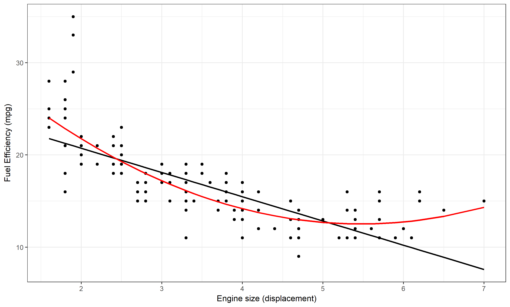

(\#fig:phenomodel)Two phenomenological models, a linear and quadratic equation, fit to data. The data and model suggest that there is a clear pattern of decreasing fuel efficiency as engine size increases. It seems the pattern is somewhat better described by the quadratic model.

One feature these phenomenological models have in common is that they do not try to describe the _mechanisms_ of interactions within the system that lead to the observed patterns. For instance, if we find that the relationship between the number of cigarettes smoked per day and the 5-year risk of lung cancer can be approximated by a sigmoid function, it does not tell us much about the mechanisms leading from smoking to lung cancer. 

#### A few more comments regarding phenomenological models {#mynotebox}
The big category that I call phenomenological models can of course be further divided. A useful division and way of thinking is between fairly simple models based on some underlying statistical theory and used to explain relations between some factors and some outcome, versus more complicated, often "black-box" type of models that are mainly used to predict an outcome based on some inputs. The former area is the topic of most "classical" statistical work, while the latter often goes by names such as machine learning, data mining, or similar. While simple models are sometimes considered explanatory and can provide clues toward causal links between some inputs and some outputs, they still do not provide insights regarding the mechansisms, which distinghuishes all of these models from mechanistic ones. For more information on the explanatory vs. predictive approach to model uses, the papers [@shmueli10] and [@breiman01] are good starting points.

### Mechanistic Models
A class of models that is complementary to the just discussed phenomenologica models are mechanistic models, which explicitly - albeit usually in very simplified form - try to model the mechanisms of interaction among system components. These models are commonly used the hard sciences and engineering. For instance the mathematical equations describing the movement of fluids or electromagnetic fields, or computer simulations of airplane engines, are based on such mechanistic models. The advantage of these kinds of models is that they potentially provide better and deeper understanding of the system. The main disadvantage is that we already need to know (or at least assume) a good bit about how the components interact for us to be able to build such a model. If we have no idea what mechanisms are at work in our system of interest, we cannot build a mechanistic model. Because of that, areas that are currently less well understood (e.g. the functioning of the stock market or the working of brains) are currently not well described by mechanistic models.

One advantage of a mechanistic model is that once it is specified and built, it can be investigated (either mathematically, or more likely through computer simulations) without the need of additional data. For instance, our ability to build decent models capturing the salient features of hurricane dynamics allows us to forecast the storm trajectory. An example of a simulation for a simple mechanistic model is shown in Figure \@ref(fig:sirsim).

Both phenomenological (statistical) and mechanistic models are useful tools with distinct advantages and disadvantages. Deciding which one to use depends on the question and study system. In this book, we focus on mechanistic models, which try to represent an explicit, simplified description of the system of interest. 

### Dynamical Models
While the interactions of components always have some implicit time factor, the explicit consideration of time in models is not always needed. Consider this example: We could build a model to study how a change in tobacco taxes might lead to changes in healthcare costs in a given state. Of course, time is present in this system: First we change the taxes, and then we look at changes in costs over some time frame. However, when studying this system, one usually doesn't need to consider an explicitly time-dependent dynamic. Instead one looks at 2 scenarios: Taxes 1 & Costs 1 versus Taxes 2 & Costs 2. It is usually not necessary to model or simulate the chain of events leading from tax change to cost change while explicitly accounting for time.

However, often the interactions of components that make up a system occurs over time and the temporal component needs to be included. We often want to know how certain changes to the system (e.g. interventions) lead to changes in outcomes through a *dynamical/time-dependent* chain of events. This leads to dynamical models. For infectious diseases, we most often have some underlying dynamics that we need to take into account (e.g. an ongoing outbreak) and on top of which we might want to implement some interventions. Therefore, the dynamical perspective is generally used. 

We can illustrate this dynamical perspective in an abstract way by extending the epidemiological triangle. Figure \@ref(fig:dynamictriangle) shows the components and the interactions of the triangle changing over time.

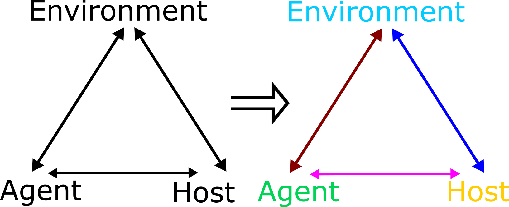

(\#fig:dynamictriangle)Dynamic Epidemiological Triangle. Interactions between agent, host and environment change explicitly with time - indicated by the different coloring for each component and interaction.

A more specific example of a simple dynamical model showing changes over time is shown in Figure \@ref(fig:sirsim).

Mechanistic models are especially well suited to describe dynamical systems and are therefore the primary choice for the study of complex dynamical systems.

### Types of Dynamical, Mechanistic Models
When building mechanistic, dynamical models based on a systems approach, there are two main approaches. In one approach, the model is made up of individuals (who are sometimes called agents) and thus these types of models are called agent based or individual based models. The agents/individuals - which are often but not always are humans - interact with each other. Each agent has certain properties and undergoes certain actions. The interactions of all the agents lead to potentially interesting and complex dynamics. 

Schelling's segregation model (see e.g. [this video](https://youtu.be/dFl3Cfw12bo) ) is a nice example of such an individual based model. Models and approaches that consider individuals connected through networks of contacts are a type of individual based model that is particularly important for infectious diseases. We will discuss such network concepts in a later chapter.

Another approach simplifies the system by not tracking every individual, but instead only keeps track of total numbers in certain states. For instance, for an ecological model, we might track the total numbers of predators and prey (e.g. wolves and sheep). The resulting model is much simpler. If we had a population of a 100, 1000 or 10,000 wolves or sheep, we would need to keep track of as many individuals. If we only keep track of the total number of individuals, we only need to track how the numbers in each *compartment* (here wolves and sheep) change - no matter how large our population. Those models, which only track total numbers of individuals, are called *compartmental models*.

While these compartmental models are obviously simplifications of the real system, they often retain enough of the model complexity to allow us to study the system in detail. Because of this, the majority of models used in infectious disease epidemiology are still these types of compartmental models. Both the DSAIDE R package and the example models shown in this book focus on such compartmental models. The only exception is the chapter on networks. 

## Systems approaches in ID Epidemiology 
While concepts such as the epidemiological triangle acknowledge that interactions between components are important and determine the behavior of a system, in practice the standard epidemiological approach, based on classical study designs such as cohort, case-control and the randomized trial does not consider system interactions. Indeed, a hallmark assumption of these study designs is that individuals are independent. E.g. the chance that someone in a cohort study has the outcome of interest does not affect the chance of someone else having the outcome. That works well for non-transmissible diseases, and to some extent for transmissible/infectious diseases (we'll use the term infectious disease in the following, mostly meaning diseases that are also transmissible), as long as there are no interactions  (i.e. contact that could lead to transmission) between study subjects. Accounting for interactions between hosts is required to understand important infectious disease concepts such as population level immunity thresholds, critical community size, or indirect effects of interventions. This, in turn, leads to a systems approach that explicitly allows for interactions between hosts.

On the research side, the importance of such interactions has long been appreciated and is at the core of the infectious disease modeling paradigm, where one builds and analyzes a system of interacting components (e.g. susceptible and infected hosts). Model based system approaches have a long history in infectious disease epidemiology [@anderson91, @blower04]. The importance of computational methods for the study of infectious diseases continues to increase. In this book, we approach infectious diseases from such a systems thinking perspective, without delving too deeply into the mathematical and computational aspects of the topic. If you are interested in building your own models, the books [@keeling08; @vynnycky10] are good starting points.

## A Basic Infectious Disease Systems Model
For infectious disease models, the simplest dynamical systems model keeps track of the total number of individuals who are susceptible, infectious and removed/recovered (the so-called SIR model). This model is a compartmental model, i.e. we place individuals into distinct compartments, according to some characteristics. We then only track the total number of individuals in each of these compartments. In the simplest model, the only characteristic we track is a person's infection status according to 3 different stages/compartments: 

* **S** - uninfected and susceptible individuals. 
* **I** - infected and infectious individuals.
* **R** - removed (recovered and immune or dead) individuals. Those are individuals that do not further participate, either because they are now immune or because they died.

When talking about the quantities that are tracked in each compartment, you will see both the term *host(s)* and *individual(s)* used interchangeably. While we most often think of human hosts, the hosts can be any animal (or plants infected by viruses or bacteria infected by phages, etc.). Sometimes, a compartment might track a quantity such as pathogen load in the environment. 

In addition to specifying the **compartments** of a model, we need to specify the **processes/mechanisms** determining the changes in each compartment. Broadly speaking, some processes increase the number of individuals in a given compartment/stage and processes that lead to a reduction. Those processes are sometimes called inflows and outflows. 

For our system, we specify only 2 processes/flows: 

1. A susceptible individual (S) can become infected by an infectious individual (I) at some rate (for which we use the parameter _b_). This leads to the susceptible individual leaving the S compartment and entering the I compartment.   
2. An infected individual dies or recovers and enters the removed (R) compartment at some rate. This is described by the parameter _g_ in our model.

In general, the entities that change (that vary) in our system (here the number of individuals in compartments S, I and R) are called variables and are each represented by a compartment. In contrast, the quantities that are usually assumed fixed for a given system are called parameters. For the model above, those are the infection rate _b_ and the recovery rate _g_. This is not a fixed rule, though, and sometimes parameters can be allowed to vary.

The SIR model is very basic, but it still has the hallmark of a complex system. Specifically, there is an interaction between components, namely the **I** component interacts with the **S** component, namely infected individuals can infect susceptibles. 

For compartmental models (and often other types of models), it is useful to show a graphical representation of the compartments and processes included in the model. For compartmental models, such a diagram/figure is usually called a flow diagram. Such a diagram consists of a box for each compartment, and arrows pointing in and out of boxes to describe flows and interactions. For the simple SIR model, the flow diagram is shown in Figure \@ref(fig:basicSIR).

(\#fig:basicSIR)Flow diagram for the simple SIR model.

To study a specific ID and scientific question, one needs to use a model that approximates the real system one is interested in reasonably well, and one needs to choose values for the model parameters and starting conditions such that they match the specific system one wants to study. We'll return to that idea throughout this book.

We can implement the flow diagram as a computer model, for instance by formulating it as the set of ordinary differential equations shown below, and then implementing those on a computer to simulate an outbreak. Figure \@ref(fig:sirsim) shows such a simulation.

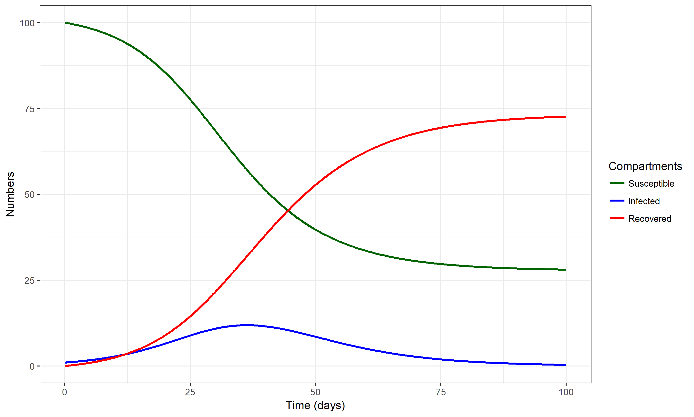

(\#fig:sirsim)An outbreak simulation using the simple SIR model. Values for parameters are chosen as b=0.0025/days and g = 1/(7 days). The starting conditions for each compartment are set to S=100, I=1, R=0.

For some more further information on compartmental models in epidemiology, [check out this Wikipedia article](https://en.wikipedia.org/wiki/Compartmental_models_in_epidemiology). We will also discuss many variants of these type of compartmental models in further chapters.

#### Notes {#mynotebox}
Unfortunately, there are no rules concerning the naming of variables and parameters. Compartments (e.g. SIR) tend to be labeled very similarly by different researchers, while parameter labels are much more variable. I'm trying to be consistent in this book, though I might mix it up occasionally. For this book, I decided to stick with letters from the English alphabet, but you can often find people use Greek letters for parameters (e.g. $\beta$ instead of _b_ for the transmission parameter). Always check carefully what the definition and meaning of each variable and parameter are. 

Here and in other places, I am often sloppy and use the word "infected" even if more precisely, I mean "infected and infectious". You will find such somewhat sloppy terminology throughout the literature. Individuals who are infected but not infectious are often given their own compartment and label, e.g. they are called "exposed" or "latent" - see chapter \@ref(idstates) for more on this. So when you read infected throughout this book (and in most other places), assume it means 'infectious' as well, unless otherwise stated.

#### Model Implementation {#myadvancedbox}
If one wants to study any model in detail, one needs to implement it either in the form of a mathematical or a computer model (or both). For compartmental models, the most common way of implementation is writing the model as a set of ordinary differential equations and implementing those in some computer language. This book shows sets of ODE equations for most of the discussed models, but a detailed understanding of these equations is not required to understand the different topics we discuss. For the model described above, the equations look like this: 
$$\dot S = -bSI$$
$$\dot I = bSI - gI$$
$$\dot R = gI$$

We are using the usual short-hand notation, where a dot over a variable means its derivative (its change) with respect to time. In all the models we consider, we always only consider changes with respect to time (the dynamical aspect of the model). The left side indicates which variable changes, and the right side indicates how it changes. Anything with an (usually not shown) positive sign on the right side describes a positive change, i.e. an inflow into the specified compartment, thus increasing the number in that compartment. Anything with a negative sign indicates an outflow out of that compartment. 

## Summary and Cartoon
This chapter provided a brief introduction to the concept of systems thinking and how modeling is used to study complex systems. We briefly looked at a simple infectious disease systems model, the famous SIR model. 

(\#fig:complexcartoon)Not every diagram helps to understand a complex system. [Source: xkcd.com](https://xkcd.com/1488/).

## Exercises
* If you haven't done already, install R, RStudio and the DSAIDE R package. See [@handel17] for an overview and quick-start guide for DSAIDE.
* Work through the tasks for the _ID Dynamics Introduction_ DSAIDE app.
* Contemplate on your experience with the _ID Dynamics Introduction_ DSAIDE app. In which way does it capture the 'dynamical systems' perspective? Did you find any behavior of this - arguably very simple - infectious disease model to be complex? How/why?
* Read the paper "Systems Science Methods in Public Health: Dynamics, Networks, and Agents" by Luke & Stamatakis [@luke12]. Come up with 2 systems that you consider complex in the realm of public health or biomedicine (other than those mentioned in the paper). Explain what makes them complex. Also, come up with 2 systems that you consider not complex and explain why you think of them as not complex.

## Further Resources
* The paper "Why Model?" by Joshua Epstein [@epstein08] provides a nice, short discussion of the purposes of models. Other general introductory discussions of systems thinking and model use are [@may04; @chubb10; @garnett11; @basu13; @gunawardena14; @homer06; @peters14; @sterman06].
* Several introductory papers on infectious disease modeling can be found in e.g. [@keeling09; @heesterbeek15; @lessler16; @metcalf17].
* While the dynamical systems approach has been applied to infectious diseases for a long time, it is starting to be used more frequently in other areas of public health. Some recent references on that topic are e.g. [@ness07; @sanchez-romero16].
* If you want to learn more about individual based models, see e.g. [@railsback11].

## References

<!--chapter:end:100-IDDynamicsIntro.Rmd-->

# Characterizing Infectious Disease States {#idstates}

## Overview and Learning Objectives
In this module, we will discuss ways to characterize individuals with regard to their infection status, e.g. susceptible, symptomatic infected, revovered and immune. We will consider why some infection states are important for public health control but less important from an individual patient, medical perspective, and the reverse. We will also discuss the connection between infectious disease states and compartments in computer models. 

The learning objectives for this chapter are:

* Ability to accurately categorize infectious diseases according to medical and public health characteristics
* Evaluate the impact of different infection states on medical outcomes and disease dynamics 
* Understand how "medical states" (e.g. symptoms) and "public health states" (e.g. infectiousness) do not always overlap.
* Identify the features of infectious diseases that are most important to know for successful intervention planning
* Understand how different infections states are represented in mathematical models 

## Introduction
In the previous chapter, we introduced a very simple compartmental systems model for an infectious disease (the SIR model) where individuals were split according to 3 states related to the infectious disease of interest: susceptible, infected (and infectious) and recovered (and immune). Sometimes, placing individuals into one of these 3 categories provides a reasonable approximation of reality. It is easy and thus often a good starting point. However, at some point we might want to categorize infection states of individuals in some more detail. For instance, for a disease like tuberculosis, a large fraction of individuals who are infected are not infectious. Thus, combining all of those who are infected into a single group is not realistic. We have to allow for more distinct categories. there is potentially an unlimited number of states we can consider. For instance for HIV, we could categorize infected individuals into sub-groups based on their CD4 cell count - and the number of such sub-groups is essentially infinite. Fortunately, to get a fairly realistic picture of most diseases, we can usually get away with introducing just some additional categories. The following sections discuss the major categories with regard to infection status of individuals.

## States of susceptibility
The simplest assumption is to classify everyone as susceptible. While this is true in some instances, e.g. for a newly emerging disease, often this assumption is not justified. Depending on the disease and population, some individuals might not be susceptible, e.g. because they previously had the infection and have natural immunity, or they received a vaccine or they have a genetic make-up that makes them non-susceptible (examples are the CCR5-delta 32 mutation in HIV or the FUT2-G428A for some norovirus strains). The easiest way to deal with individuals who are not susceptible is to "ignore" them, i.e. simply not include them in any models for that disease. Alternatively, if the model has a recovered and immune class, one can place all those individuals in that category.

It gets more complicated if susceptibility is only somewhat reduced. This is common for some vaccines, which often do not offer full protection, but instead reduce the chance of getting infected (and if infection occurs, often disease severity is reduced). If you wants to account for this, you will have to introduce a new state into your conceptual/mathematical/computer model. For instance you could have a category _S_ of fully susceptible individuals, and a category _Sp_ of partially susceptible. Those individuals would get infected at a lower rate compared to fully susceptible individuals. If reduced susceptibility can wane, e.g. due to the wearing off of a vaccine induced immunity, one might need to include a process in the model by which _sp_ individuals transition back into the _S_ category.

## States of Infection 
Categorizing individuals beyond the simple _infected and infectious_ category is often the most important addition to a model if one wants to make things more realistic. Several important states are commonly distinguished and described in the next few sections.

### Latent infection
Many important diseases (e.g. HIV, Tuberculosis), have a state during which an individual is infected but does not show any symptoms. This is usually called _latent_ infection. Sometimes the term _exposed_ is also used. Latent, non-symptomatic infected individuals might (HIV) or might not (TB) be infectious. It is important to keep in mind that infectiousness and symptoms are not always overlapping. The former is the most important driver of the ongoing infection process and drives the observed disease dynamics on the population level. The latter is important for surveillance and medical interventions. 

### Symptomatic infection
From a purely medical perspective, focusing on one patient at a time, the most important characteristic of a disease is its severity, also called morbidity. We would like to know what kind of symptoms a disease produces and how frequently those occur. This is the morbidity profile of a disease. One can consider mortality the "ultimate symptom". Because of its importance, mortality is often considered separate from morbidity. Knowing morbidity and mortality of an ID are generally most important when caring for individual patients. For interventions, understanding what might help mitigate morbidity and mortality is of prime interest.

Most diseases lead to a state with morbidity, i.e. where an infected individual shows symptoms. Those diseases that don't are usually not of much medical and public health interest. During the symptomatic state, individuals are generally infectious. The question how symptoms might or might not impact infectiousness is important but not too well understood. Qualitatively, we know that coughing and sneezing help spread many respiratory pathogens, while the symptoms an HIV infected individual displays during the AIDS stage are likely not increasing infectiousness. The connection of symptoms, morbidity and mortality and its relation to infectiousness is the main theme underlying the topic of _virulence_, which we'll cover later in the chapter on virulence evolution. 

Morbidity and mortality are also often important for public health surveillance. It is generally difficult to capture infected individuals that do not show symptoms, those that are symptomatic - and obviously, those that die - are easier to count and thus get estimates for disease prevalence and incidence.

### Asymptomatic infection
After infection, for almost all diseases there is a latent period when symptoms are not yet visible. For many diseases, the whole course of infection is asymptomatic in at least a fraction of infected individuals. If such asymptomatic individuals are infectious, they are a potentially important driver of the infection dynamics. Since asymptomatic indivuals are often not picked up by surveillance, they can pose problems for the control of a disease. 

Note that some diseases can show complicated patterns of symptoms, e.g. for malaria symptoms can be intermittent, with periods of no symptoms in between.

## Post-infection states 
After infection is over, it is possible for an individual to enter different states. So far, we only considered a _recovered and immune_ state. in the classic SIR model, those _R_ individuals are immune forever and thus do not further influence the systems dynamics. However, some infectious diseases either do not induce immunity (e.g. many sexually transmitted diseases) or only lead to short-term immunity (e.g. norovirus or influenza). If a disease does not induce immunity, one can conceptualize and model this by assuming that after infection, individuals directly enter the susceptible state again (leading to the SIS model). 

If we assume that everyone has immunity only for a short period of time, we can account for that by having infected individuals first enter the recovered state, and then from that state move at some rate back to the susceptible state (leading to the SIRS model).

Things can get more complicated when combined with different infection states. For instance it might be that those individuals who had an asymptomatic case of the disease aquire immunity that lasts less long compared to those who were symptomatic infected. We then need to have 2 different recovered compartments, each with its own rate of returning to the susceptible state.

A special and important post-infection state is death. From a ID dynamics perspective, a dead person generally behaves like a recovered and immune person, i.e. they do not further influence the infection dynamics (ignoring special cases such as e.g. Ebola where transmission after death has been observed). Of course, from a medical and public health perspective, a recoverd and immune person is a favorable outcome while a dead person is not.

## Medical versus ID dynamics perspectives
I hope that the above description of different states made it clear that features that are important from a medical perspective (e.g. severity of symptoms), might or might not be important for understanding the dynamics of the disease. To properly study the dynamics of an ID, we need to know when someone is infectious (e.g. before/without symptoms, or only when symptomatic), how transmission occurs, if recovered individuals become immune, if immunity is waning, etc. The difficult part is that our data often comes from clinical (symptomatic) cases or deaths. If asymptomatic individuals are infectious, or there is underreporting, we often don't get the full picture. This is discussed further in the surveillance chapter.

Of course, the medical and ID dynamics/epidemiological perspectives are not an 'either/or'. Instead, success in combating infectious diseases only comes when all aspects are considered. Still, it is useful to keep in mind that certain infection states are more important when considering how to intervene on the individual patient level versus intervention on a population level.

## Models with more details
The above sections described different states that might need to be considered and explained how models will need to be adjusted to account for such different states. To make this more specific, figure \@ref(fig:complicatedmodel) shows a model with additional compartments. We omit showing a mathematical representation (i.e. a set of differential equations) for this model. However, a very similar model, together with the equations, can be found in the DSAIDE app referred to below in the exercise section.

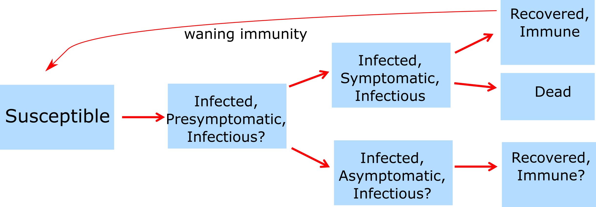

(\#fig:complicatedmodel)Example of a model with more compartments.

## How much detail is needed?
While we discussed major ways to categorize individuals (e.g. symptomatic versus asymptomatic or infectious vs non-infectious), one can potentially sub-divide any state into as many sub-states as one wanted. For instance one could split infected individuals into 10 different levels of infectiousness. The question then becomes: How detailed and complex should our model be? What details should we include and which ones should we omit? This is an important question and deserves a detailed answer, which I am trying to provide in the Appendix, Chapter \@ref(modelcomplexity).

## Case study examples

_To come_

## Summary and Cartoon
This chapter discussed ways to characterize an individual host's state with regard to an infection. We discussed the differences between medical and public health perspectives and how ID states can be mapped to models. We also briefly discussed how one should build models that provide the right amount of complexity.

(\#fig:coldcourse)Yet another perspective on ID infection states. [Source: xkcd.com](https://xkcd.com/1612/).

## Exercises
* The _Characteristics of ID_ app in the DSAIDE package provides hands-on computer exercises for this chapter.
* Suggest a real ID that might be approximately described by the _Characteristics of ID_ DSAIDE app. Approximately what values for the different parameters would be appropriate to describe the ID you have in mind? See what you can find for the different parameters of the ID you chose in the literature.
* Read the paper "Modelling an outbreak of an emerging pathogen" by Kajita et al [@kajita07]. The paper lists 8 assumptions that went into constructing the model. Is there any assumption that you might have made differently, and why? Are there other assumptions the authors make when building the model that are not included in their list of assumptions? If your next step would be to further increase model realism, what would you do, i.e. what feature(s) would you include that are currently not in the model?

## Further Resources
* The following papers provide some additional information on the ideas discussed in this chapter: [@fine03; @milwid16].
* A good example showing how different assumptions about ID states can lead to different conclusions, and how models can be used to discriminate between alternate hypotheses can be found in [@king08].

## References

<!--chapter:end:110-CharacteristicsofID.Rmd-->

# Patterns of Infectious Disease Dynamics

## Overview and Learning Objectives
In this module, we will discuss different patterns of ID dynamics, such as single outbreaks, recurrent cycles, and steady endemic states. 

The learning objectives for this chapter are:

*    Understand the concept of resource replenishment
*    Know the different mechanisms that can lead to ID cycles
*    Understand the concept of endemic state
* Understand what leads to different ID patterns 
* Understand the difference between intrinsic and extrinsic drivers of ID cycles

## Introduction
Different IDs show different patterns in their dynamics. Some IDs produce sporadic outbreaks and then seem to disappear for years. Ebola is a prominent example. Other ID seem to be 'always around' and incidence or prevalence might change little. TB and HIV in some parts of the world, as well as certain STD and chronic viral infections show such patterns. Many other IDs show oscillatory behavior, i.e. we repeated outbreaks or increases in incidence, followed by periods of reduced incidence. For some ID, these patterns of increase and decrease are annual, for other ID the cycles are multi-year. Figure \@ref(fig:IDcycles) shows an example of such patterns of increase and decrease for measles and pertussis.

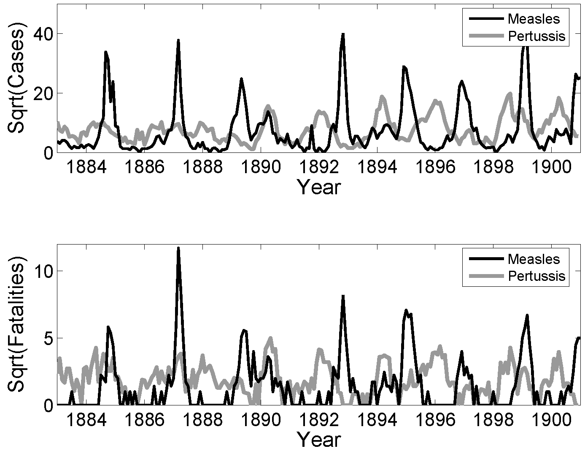

(\#fig:IDcycles)Examples of ID cycles. From [@keeling08].

Understanding the nature of the different patterns seen for ID help understand the general 'behavior' of the ID and can also point to best approaches of minimizing specific IDs.

## Resource Replenishment
The basic SIR model considered in chapter \@ref(idintro) can capture the dynamics of a single outbreak, it can however not reprduce repeat oscillations or endemic states. The reason for this inability of the simple model to produce more than one outbreak is because as the ID spreads, it depletes the pool of susceptibles. At then end of the outbreak, there are not enough susceptible individuals left to allow for a second outbreak or an endemic state. In ecological terms, the infectious disease depleted its resources (i.e. its hosts) and subsequently dies out. This is a very general principle: We see that in predators consuming prey, forest fires consuming trees, and pathogens "consuming" their susceptible hosts. If the resources are not replenished quickly enough, the consumer of these resources will go extinct. To sustain the continued presence of the consumer/predator, resources need to be replenished. 

For our scenario, the resource consumer is the ID, and the resources are the susceptible hosts, usually humans. To sustain endemic states or repeat increases in incidence, susceptible hosts need to be entering the system. This can happen through different mechanisms. The most common processes to add new susceptibles to a population is through the birth of new, susceptible individuals, or through the loss of immunity, and return to the susceptible class, of existing hosts. Migration, if strong, can be another way susceptible hosts can be replenished. Similarly, individuals that become newly sexually active correspond to the birth of new susceptibles for sexually transmitted infections. 

If the replenishment of new susceptibles is fast enough to balance the depletion of resources by the ID, an ID might be able to maintain itself in a population and lead to either oscillatory patterns or an endemic state.

## A Model with Resource Replenishment 
A version of the SIR model that includes resource replenishment through natural births or waning immunity is shown in figure 
\@ref(fig:birthdeathdmodel). 

(\#fig:birthdeathdmodel)Example of an SIR model with births, deaths and waning immunity.

The new features of this model compared to the basic SIR model introduced earlier are births (of susceptibles) at some rate _m_, and the possibility that recovered lose their immunity and return to the susceptible class at rate _w_. Both of these processes can produce new susceptibles and thus lead to resource replenishment. If this process is fast enough, it can allow the ID to persist and lead to oscillations/cycles or steady states.

#### Notes {#mynotebox}
The model shown in \@ref(fig:birthdeathdmodel) also includes natural death at rate _n_. This is done to for several reasons. One is simply consistency. If we make the model more detailed by taking into account natural births, it seems reasonable to also include natural death. Another, related reason is that without death in the model to balance births, we would have a population which grows without bounds. This is not a good approximation of any real scenario. When you implement models, especially larger ones, you always want to make sure that each component of the model produces reasonable results by itself. In this example, in the absence of disease, we would like to have susceptible individuals reach some steady level depending on births and deaths. Without the inclusion of the death rates, this could not happen.

#### Mathematical Equations for the Model with Resource replenishment {#myadvancedbox}
The ordinary differential equations corresponding to the compartmental model shown in figure \@ref(fig:birthdeathdmodel) are given by

$$\dot S = m - b I S + wR - n S $$ 
$$\dot I = b IS - gI - n I $$ 
$$\dot R =  gI - wR - n R$$

## Intrinisic Cycles 
The interaction between susceptible and infectious hosts can lead to a dynamical pattern that can/does produce oscillations. Specifically, the dynamics of resource consumption (depletion of susceptible hosts), waning ID incidence due to reduced availability of hosts, and subsequent replenishment of susceptibles can lead to cycles. Since these cycles are not driven by anything "from the outside" and arise purely due to the complex interplay between host resources and ID, there are sometimes called intrinsic cycles/oscillations. The timing of these cycles (the period of the oscillations) is determined by characteristics of the ID and scenario. For instance, the duration of the infectious period and the transmissibility of the host influence the timing of outbreaks. In ecology, such cycles are well studied in the context of so-called predator-prey systems. For our infectious disease models, the "prey" are the susceptibles and the "predators" are the infected individuals.

## Intrinisic Cycles and models 
One can sometimes compute the time between outbreaks. For the simple compartmental SIR model, an approximate equation for the period close to the endemic state is 
$$T \approx 2 \pi \sqrt{\left( \frac{LD}{R_0 - 1} \right)}$$

Here, _L_ is the average lifespan of a host, _D_ is the average duration of infectiousness, and _R~0~_ is the basic reproductive number - a quantity we will discuss in chapter \@ref(R0) For more details on this equations, see e.g. [@keeling08].

For more complicated models and real-world scenarios where the simple SIR model is not a good approximation, the equation just provided does not apply anymore. It might not even be possible to write down any equation. One can then instead run a computer simulation of the model and determine the length of the cycles from the time-series returned by the computer. The main point still holds, independent of the ability to write down an equation for the cycle length, namely that there is a relation between intrinsic characteristics of the system, such as duration of infectious period (_D_) and transmissibility of the disease (_R~0~_), and the period of the oscillations. In cases where we cannot derive a mathematical equation, we can try to figure out the relation between cycle duration and some parameter of interest. This can be achieved by repeatedly altering the parameter (e.g. the duration of the infectious period, _D_), and recording the cycle period, _T_, reported by the model simulation for various values of the parameter. By plotting a figure showing _D_ on the x-axis and _T_ on the y-axis, we obtain a relation between these quantities. 

## External Drivers of Cycles
Another mechanism that can lead to oscillations in the dynamics of ID can come from "external" drivers. Of course, these processes are still part of the whole system, but not as directly as the dynamics and interaction of the hosts. In that sense, we consider it an external process. 

Weather is one of the most important external factors. Many IDs are influenced by the weather. For instance influenza virus survives better when the vapor pressure is low, which in temperate regions is usually the case in winter [@lipsitch09, @shaman10]. 

Other types of seasonality are related to human activity and behavior. For instance, many childhood diseases increase in incidence when a new school year starts. 

For some ID, weather and behavior interact. Many water-borne diseases in the U.S. see an uptick in summer. This is due to behavior changes in the host: More people swim in outdoor water in the summer. 

Often, more than one mechanism occurs and influences the ID dynamics. As such, it is often not possible to isolate a single factor as the main important one. It often depends on the particular setting.

#### Notes {#mynotebox}
In the type of models we have looked at so far, seasonality or some other external driver is needed to sustain oscillations. Without it, the cycles die out, and the disease reaches a steady, endemic state. For more complex models or models that include stochastic dynamics (discuss in chapter \@ref(stochastic)), cycles can be maintained even in the absence of external drivers.

## Steady states
In addition to single outbreaks or recurrent cycles, ID often also reach a state where the prevalence in a population is roughly constant. This is usually referred to as an endemic state. Examples of that are e.g. helminth infections in many African countries (in the absence of control efforts) or certain sexually transmitted diseases in developed countries. 

At steady state, the total number of ID cases (the prevalence) does not change. Nevertheless, it is important to keep in mind that there are still constantly new cases occuring, i.e. the incidence is not zero. It just happens to be the case that the incidence is roughly similar to the rate at which existing cases disappear (e.g. through recovery or death), such that the turnover process is in balance, leading to a a roughly constant prevalence.

If we have a mathematical or computer model of our system, there are two ways to determine steady states. One is mathematical, and the other is through simulating the system. The former approach is more elegant and powerful but only works if we have a relatively small model. It is illustrated in the box below. Often, the model is too complicated to obtain useful equations for the steady state values of the model variables. Fortunately, we can always determine them numerically. We simply start our computer simulation model with some values and run it long enough until it has settled down (we need to make sure it does have a steady state). We can then record the steady state values. We can do this for different model parameter values (e.g. changes in birth rate or changes of rate of infection). In the end, we can plot a figure showing how the steady state values change with some model parameter. This approach is obviously much slower than using the mathematical equations. However, often it is the only feasible approach. 

Note that there are technically steady states that exist but won't show up in the simulation since they are unstable. Since any unstable steady state also rarely exists in nature (other than the disease free state, with a population remaining in that state until a new pathogen arrives), those steady states tend to be not that important in practice.

#### Steady States and Models {#myadvancedbox}
When an ID reaches a steady state, a model based on ordinary differential equations, such as the model shown above, simplifies. At steady state, there are -- by definition -- no changes in the total number of individuals in each compartment. Therefore the left side of the equations are zero, i.e. $\dot S = \dot I = \dot R =0$. This changes the differential equations into a set of algebraic equations. For a fairly small set of equations (usually < 5), one can obtain equations for the compartments (_S_, _I_, and _R_ in this case) at steady state that are a function of the model parameters. While it is often theoretically possible to solve models with more compartments/equations, the resulting expressions are usually so big and unwieldy to not provide much useful insight.

The hard method of solving this set of equations is with pen and paper. Nowadays, there is software that can do it for you. The two most important packages for such tasks are [Maple](http://www.maplesoft.com/) and [Mathematica](https://www.wolfram.com/mathematica/). Both are commercial products, fairly powerful and quite expensive. If you only need a program for occasionally solving such equations, free alternatives are available. I usually use [Maxima](http://maxima.sourceforge.net/).  [Other packages exist](http://en.wikipedia.org/wiki/Comparison_of_computer_algebra_systems). Note that `R` is not suitable for solving symbolic equations. Using Maxima to solve the equations above (without immune recovery, i.e. _w=0_, to make the results simpler) gives:

(\#fig:SSmaxima)Maxima code for solving the SIR model steady state equations.

The same results are of course obtained when solving the equations by hand. The first steady state returned by maxima is the one in the absence of an ID, with only susceptibles around. Usually, we are interested in the second steady state, the endemic equilibrium at which disease prevalence is at a fixed level. We thus find the values for the number of susceptible, infected and recovered at steady state as a function of the model parameters.

Having the equations for the steady state allows us to gain insight into the system behavior rapidly. For instance we can see that for an endemic steady state to be possible (i.e. for _I_ > 0 at steady state), we need $b m >  n (n+ g)$. We can make intuitive sense out of this expression: The combination of pathogen transmission capacity (_b_) and birth rate _m_, which support ID persistence, needs to be stronger than the effects of general host death _n_ and host recovery _g_. We will later see that this relates to the concept of reproductive number.

## Detecting cycles or other patterns
It is often hard to determine if there is a specific repeating pattern, such as oscillations/cycles for a given ID. Consider for instance Figure \@ref(fig:gonorrheapattern) ([Source CDC](http://www.cdc.gov/STD/stats06/images/trends-img-2.gif)). 
One can see that Gonorrhea incidence was fairly stable between 1950-1965 and again 1995-2005, with ups and downs in between. The changes are not rapid enough to be due to seasonal/annual drivers. If we had more data and the same up-down pattern repeated, we could speculate that this might be due to some intrinsic oscillatory dynamics of the disease. In this case, the most likely explanation for the observed patterns lies outside the disease dynamics itself. Increased detection and treatment likely led to a decline in the 40s, changing sexual behavior lead to an increase starting in the 60s, and strong safe-sex campaigns, combined with the threat of HIV, resulted in a decrease starting in the 80s. However, this is somewhat speculative. It might well be that other factors, (e.g. changes in surveillance intensity) could explain the pattern. A careful analysis (which I have not done) would be needed before one can be more confident as to what might lead to the observed pattern.

(\#fig:gonorrheapattern)Gonorrhea cases in the US.

## ID Dynamics in Changing Populations
The idea of resource replenishment described above assumes in its simplest forms that in the absence of the ID, the host population is in steady state. That is, the number of births and deaths balance each other, and the population size, therefore, stays constant. We then investigate ID dynamics on top of such a constant population (which then might not be constant anymore if the disease leads to many deaths).

One can go a step further and consider an underlying population that changes in size due to underlying growth or decline of the population. We can then study the dynamics of an ID on top of an already dynamically changing population. While this is not much more complicated to do with computer models, it is harder to understand what exactly is going on in the system. For instance, consider an ID with high mortality in a growing population. If we just looked at the population size, it could be that it remains constant, due to the two processes of natural population growth and disease induced mortality balancing each other. We, therefore, need to study how the different processes affect ID dynamics carefully.

## Summary and Cartoon
This module provided a discussion of the various general patterns we observe in the dynamics of ID. Those are individual outbreaks, cycles of repeated outbreaks, and steady endemic states. 

(\#fig:sciencenewscycle)Here is a different kind of cycle that (ID) scientists sometimes encounter. [Source: phdcomics.com](http://www.phdcomics.com/comics/archive.php?comicid=1174).

## Exercises
* The _Patterns of ID_ app in the DSAIDE package provides hands-on computer exercises for this chapter.
* Find a scientific article/paper that investigates the incidence/prevalence pattern of some ID. Summarize the article. Discuss why one sees the observed pattern (and not one of the others). Speculate what kind of change to the ID/system could change the observed pattern (even if that change is not biologically realistic).
* Read the article "Dynamical resonance can account for seasonality of influenza epidemics" by Dushoff et al [@dushoff04]. They suggest an interesting explanation for the seasonal variation in influenza cases. Look at the literature to see if since that paper came out, there has been any further progress on that question. Discuss recent advances that might support or refute the idea suggested by Dushoff et al.

## Further Resources
* The following references provide some more information on and discussion of seasonality in IDs: [@altizer06; @dowell01; @grassly06; @stone07].
* Seasonality for influenza has been heavily studied, some references are [@dushoff04; @lofgren07; @baumgartner12]. 
* A discussion of cycles in Cholera can be found in [@pascual02; @emch08].

## References

<!--chapter:end:120-PatternsofID.Rmd-->

# Reproductive Number  {#R0}

## Overview and Learning Objectives
The reproductive number is a fundamental concept in infectious disease epidemiology. It is so important, it even made its way into (at least) one mainstream movie [@contagionmovie]! It is simple in its definition and rather useful. The hard part is to correctly estimate the reproductive number for a given disease and scenario. 
We will discuss all these aspects in the following.

The learning objectives for this chapter are:

* Know how the reproductive number is defined
* Kow how to compute the reproductive number from data
* Apply the reproductive number concept to ID control

## Introduction 
We generally want to prevent infectious diseases from causing outbreaks, stop already ongoing outbreaks, reduce the number of people getting infected, or even bolder, try to eradicate a disease. 
If we were able to make a vaccine against an infectious disease, it is useful to know what fraction of the population should be vaccinated to prevent future outbreaks or even eradicate the disease.

Assume you asked the "person on the street" the question: "If we wanted to prevent a potential future SARS outbreak, what fraction of the U.S. population do we need to vaccinate to make a large-scale outbreak impossible?" 
I suspect that most people would likely say that nearly everyone needs to be vaccinated to prevent outbreaks. A smaller number of people might realize that we don't need to vaccinate everyone, just enough people to sufficiently reduce the disease's transmission potential. To reach the second answer, one needs to have thought about how infectious diseases 'work'. 

If you happen to come across an ID public health specialist or ID modeler, you might get a different answer. Namely, they might provide you with a quantitative estimate of the fraction of people that need to get vaccinated. They might, for instance, tell you that we would need to vaccinate around 70% of the population. This is, of course, the best kind of information. How do we figure this out? That's where the reproductive number concept comes into play.

## Reproductive number definition
The concept and definition of the reproductive number are rather straightforward: The reproductive number (usually abbreviated with R), is defined as the average number of secondary infectious cases caused by one infectious individual (before they recover or die or are otherwise not able to further transmit). The following figure illustrates the concept.

From this definition of the reproductive number, it is clear that if the value is greater than 1, the pathogen keeps spreading to more and more people and we have a growing outbreak. Conversely, if R is less than 1, the outbreak will fizzle out. Because of this characteristic, it is important to know R for a given outbreak, which will then tell us how stringent the interventions need to be to bring the outbreak under control. This is more explained in the following sections.

## Reproductive number details
Let's look a bit closer at the definition for R. First, note that it applies to population **averages**. A single person might infect none, a few or many others. R does not capture this detail. It only describes the average. That's why it is, for instance, possible to have R=2.5 or other non-integer numbers. Of course, it is not possible for an individual to infect 2.5 others, but since R describes an average, such fractional infections are possible. This **population average** feature of R is a strength since it makes R relatively easy to determine. It is also a weakness since often we'd like to know the distribution in addition to the mean/average - we'll discuss that when we deal with ideas such as population heterogeneity, core groups, and super-spreaders in later chapters.

Another point to note is that the definition is about the number of new **infectious** hosts produced by one infectious host. For some diseases, being infected and being infectious are pretty much the same. E.g. pretty much everyone who is infected with HIV is also - to some degree - infectious. For other diseases, that is not the case. For instance, the majority of people who get infected with TB will never reach a state where they are infectious. To compute R, we do not count the average number of individuals an infectious person infects, but only those that later go on to become infectious themselves. The same idea applies when we talk about diseases that have multiple hosts. R is defined as the number of infectious hosts 'produced' by one infectious host of the same type. For instance, for vector-borne diseases, R would be the number of infectious humans 'produced' by one infectious human via the intermediary mosquito/vector stage. While conceptually still straightforward, measuring and computing R/R~0~ in such multi-host situations can get tricky.

## Basic reproductive number
A special case of the reproductive number is at the beginning of an outbreak when essentially everyone in the population is susceptible. In this case, when we assume everyone is susceptible, we define a special quantity called the *basic* reproductive number, abbreviated as R~0~. 
The quantity R~0~ is a measurement of the transmission potential of a disease in a particular setting. It does by definition not change during an ongoing outbreak. The more general definition of the reproductive number, R, does change during an epidemic. We'll discuss that more below.

## Reproductive number terminology
While I will be mainly using the term reproductive number, there are alternative names for R. In general, any combination of reproductive/reproduction and ratio/number is ok terminology. In its early days, R was called reproductive rate. This is *incorrect* terminology and should not be used. R is **not** a rate (there are no units of  inverse time). Why does that matter? See the 'R is not a rate' box for an example. Unfortunately, old habits die slowly and you can still see the word `rate' applied to the reproductive number in some recent publications.

#### Why R Is Not a Rate - Example  {#myexamplebox}
It is important to understand that R only provides a measure of how transmissible a pathogen is, R does **not** provide any information about the speed at which transmission occurs. This is an important limitation of R. Consider 2 infections with the similar reproductive number, say HIV and SARS, which are both estimated to have a reproductive number of around 3-4. If we let an outbreak 'run its course', we would - based on R - expect to get the same number of infected individuals. However, the dynamics at which those infections occur will be quite different. SARS spreads rapidly, i.e. an infected person infects 3-4 others within a few weeks. On the other hand, a person infected with HIV will infect others on a timeframe of years. These different dynamics have of course important implications on the control approaches against diseases. Thus, while knowing R is significant for a given disease, it doesn't tell 'the full story'. 

#### Notes {#mynotebox}
While we often say "Infectious disease X has an R~0~ of Y", this is only an approximation. R and R~0~ also depend on the setting. The potential for transmission for many ID is much higher in for instance crowded locations (prisons, slums, cruise ships), or among "high risk groups" (e.g. STD in sex workers). For example in most countries R~0~ of HIV is below 1 in the general population but HIV is not disappearing because it has an R~0~ > 1 in certain subgroups. The importance of such population heterogeneity is further discused in chapter \@ref(heterogeneity) . When we talk about R, it is therefore useful to be as specific as possible about the scenario/population/setting.

In this book, and in the literature in general, you will foten find the use of R~0~, R or _effective R_ (R~eff~) used (sloppily) in an interchangeable manner. Usually, it is clear from the context if the symbol refers specifically to ~R~0 at the beginning of an outbreak in a susceptible population, or more generally to R, the average number of secondary infectious cases produced by one infectious individual in any population.

Unfortunately, _R_ seem to be a very popular letter. In the context of infectious disease dynamics, _R_ is used both to indicate the removed compartment in an SIR model, and as abbreviation for the reproductive number. To make things worse, it is also the name of the programming language which I used to write the DSAIDE package which accompanies this book. You will just have to figure out from the context if a reference to _R_ means "computer software" or "removed compartment" or "reproductive number". Fortunately, it should always be clear what is meant.

## Outbreaks and the Change in R
As stated above, at the beginning of an outbreak, a specific disease in a certain setting will have some value R~0~. As the outbreak progresses, more and more hosts become infected and - for many diseases - either die or recover and become immune to further infection. This leads to a reduction in the reproductive number as the outbreak progresses. For instance, at the start of the epidemic with everyone susceptible, R~0~=3. Then once a third of the population have become infected and immune, an infectious person who would have infected three others at the beginning of an outbreak now 'wastes' one of their transmissions on an already immune person, and therefore only infects two others. Similarly, once 2/3 of the population have become infected and immune, R will have dropped to 1. At this point, the outbreak does not grow further (recall, we need R>1 for growth). Instead, the outbreak has reached its peak and now starts to decline, with R continuing to go down as fewer and fewer susceptibles remain.

## Reproductive Number and Outbreak Control
It is intuitively clear that if on average every infectious person "produces" more than one subsequent infectious person, we get a growing epidemic. In contrast, if every infectious person "produces" less than one subsequent infectious person, the pathogen might transmit a few times, but pretty soon it will disappear. Thus if we can achieve R~0~ < 1, e.g. through vaccination, we can prevent an outbreak from starting. Further, if during an outbreak we can intervene to get R < 1, the outbreak is going to fizzle out. Figure \@ref(fig:R0intervention) illustrates this idea. If we wanted to stop _any_ further transmission, we would need to get R even lower, namely R = 0. Intervention efforts try to achieve an R as small as possible. If we could achieve R~0~ < 1 globally everywhere, we could eventually eradicate a disease. The ability to do that depends on many factors. One important one is the R~0~ value of any ID before we start an eradication campaign. Intuitively, the higher R~0~, the harder it will be to get it to < 1. We'll make that more explicit below.

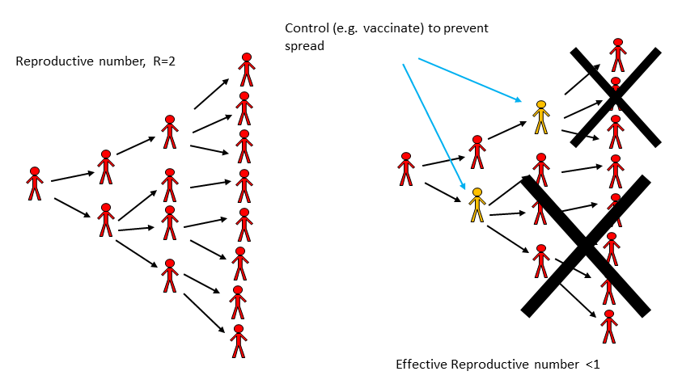

(\#fig:R0intervention)Impact of an Intervention on transmission.

#### R and Outbreak Control - Example {#myexamplebox} 
During the large Ebola outbreak in West Africa which started in 2013, a few Ebola patients came to the U.S., and the goal was to have R = 0, i.e. no ongoing transmission. That didn't quite happen, a few new individuals got infected, but R was very close to zero. In contrast, in West Africa, there was little hope to get R = 0 quickly. Fortunately, R < 1 is enough. So we can 'tolerate' a few further transmissions and new cases and still get the outbreak under control eventually. Of course, in general, we want to get R as close to 0 as possible, especially for a disease as deadly as Ebola. But to get an outbreak to fizzle out, we only need R < 1, not R = 0. 

## Estimating Intervention Efforts based on R
Let's make the relation between response efforts and the reproductive number a bit more quantitative. As a simple example, consider an infectious disease with R~0~=2. That means on average every infected person infects two others. If we could somehow protect a bit more than half of the susceptibles, then a person who might have become infected can't become infected anymore, and the _effective R_ (sometimes called R~eff~) drops below 1. More generally, to prevent an outbreak, a fraction p = 1-1/R~0~ of the population needs to be protected (e.g. through vaccination). From this, it follows that the higher R~0~, the harder it is to control and ID. This is illustrated in figure \@ref(fig:krR0intervention). One can see both from the figure and the equation that a disease with say R~0~ = 5 requires that 80% of the population is protected such that R~eff~ = 1.

The level of population protection at which R=1 is called critical population (or herd) immunity level. The relation between basic reproductive number, intervention coverage, and effective R is R= R~0~(1-p). That holds true if we assume that the intervention fully protects those to whom it is applied. If the intervention is not perfect, we have R=R~0~(1-e*p), where e is the effectiveness of the intervention (e=1 is an entirely effective intervention).

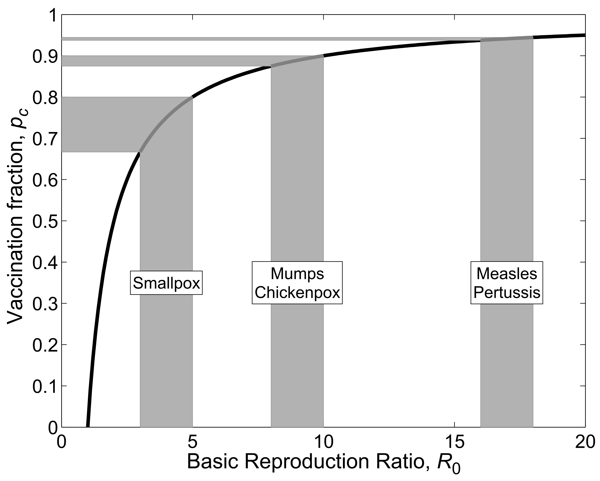

(\#fig:krR0intervention)R~0~ and Interventions. From [@keeling08].

#### R and the SIR Model {#myadvancedbox}
We can connect the concept that R>1 leads to growth and R<1 leads to a decline in infectious persons with the simple SIR model for an outbreak. The model, which we saw earlier, is given by the following set of differential equations (Don't confuse the _R_ for the recovered with the R/R~0~ from the reproductive number. Unfortunately it is customary to use the same letter for both.):

$$ 
\begin{aligned}
\dot S &= - b SI \\
\dot I &= b S I - g I \\
\dot R &= g I
\end{aligned}
$$
For this model, what needs to be true to get an increase in the number of infectious hosts? The influx of new infectious hosts, bSI, needs to be larger than the outflow, gI. This condition, bSI > gI, can be rewritten as 1 < (bS)/g. We then define the quantity on the right side of this condition as the reproductive number, R = (bS)/g. At the beginning of an outbreak, where everyone is assumed to be susceptible (written as S= S~0~), we have the special case of the basic reproductive number, R~0~ = (bS~0~)/g. Note that the rate of recovery, g, is related to the average duration of infection, D as D=1/g. Therefore, one can also write R = DbS, with the special case R~0~ for S=S~0~, i.e. at the beginning of an outbreak.

## How to determine R 
Knowing the reproductive number for a particular pathogen and scenario is important to allow for adequate intervention planning. There are multiple ways to estimate R from data. We'll briefly discuss them now.

### Determine R at the Beginning of an Outbreak 
Very early in an outbreak, there will only be a few cases, and they occur seemingly randomly/stochastically. If the outbreak continues growing after a while, the case numbers will increase exponentially. The exponential growth rate, r, can be estimated from the data, essentially by fitting a straight line to the logarithmic values of the case report data. To go from the growth rate to R, we need some further information. Namely, we need to know the serial interval. The serial interval, T, is the time between onset of infection in one host to the onset of infection in a secondary host. Sometimes T can be approximated by the duration of the infectious period, D.

Once we know r and T, we can compute R. There are different equations relating r and T to R, they depend on specific assumptions one makes about the disease. One relation between r, T, and R is given by R = 1 + rT, and another one is given by R = e^rT^ . For assumptions underlying these equations and further details, see e.g. [@wallinga07].

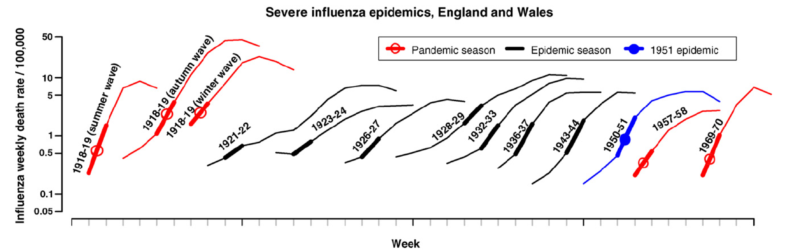

(\#fig:viboudR0)Example of R0 estimation based on case data in the early stages of an outbreak. Source: Viboud et al 2006 Vaccine [@viboud06].

### Determine R Once the Outbreak is Over
A larger R leads to a larger outbreak (ignoring things like interventions, behavior change, etc.). The reason to determine R is so we can use it to predict the expected size of an (uncontrolled) outbreak - and more importantly, we can learn how strong our intervention efforts need to be. But we can also flip things around. Once an (uncontrolled) outbreak has occurred, knowing the outbreak size can allow us to estimate R. It is often possible to determine outbreak sizes after an outbreak has occurred, e.g. through serosurveys which show antibodies against the disease and therefore indicate who got infected. We don't need any 'timing' information, just the fraction infected at the end. Essentially, we need to know the number of people that got infected, and the number of people who were at risk (i.e. the susceptibles) at the beginning of the outbreak. Once we know these pieces of the puzzle, we can estimate R.

More specifically, assume we know the final size of the outbreak, i.e. total fraction of those becoming infected, I~f~ = I~tot~/N, where N is the population at risk and I~tot~ is the total number of infected. We then also know the fraction of susceptibles that are left at the end of an outbreak, S~f~=1-I~f~. To find R/R~0~, we can use the equation R=_ln_(S~f~)/(S~f~ - 1) (here, _ln_ is the natural logarithm). The figure below shows the relation between the fraction infected and R~0~ graphically.

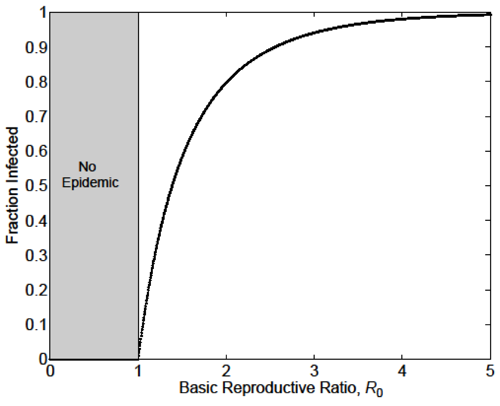

(\#fig:outbreaksize)The relation between R~0~ and outbreak Size. If we have information about the size of an outbreak (in the absence of control measures), we can use it to estimate R~0~. Source: Keeling and Rohani 2008 [@keeling08].

For the above equation to be true, we assume that initially everyone is susceptible and that the population is well mixed. More refined estimates for R, with more complicated equations, are available [@ma06].

### Determining R at the Endemic/steady state
For an ID that is at an endemic/steady state, we have another way of determining R~0~. At the endemic equilibrium, the reproductive number is R~eq~ = 1. If it weren't, the ID would either grow or decline, and it wouldn't be the endemic state. At this endemic state, a fraction of the population is still susceptible, S~eq~. By definition, at the beginning of an ID with transmissibility R~0~, everyone is susceptible (S~0~=1, expressed as a fraction). If we know S~eq~, we can then compute R~0~ as given by R~0~ = R~eq~ S~0~/S~eq~ = 1/ S~eq~. As an example, if at an endemic state (with R~eq~=1), 50% of the population is susceptible, then at the beginning, when 100% of the population was susceptible, we have R~0~=2. Conversely, if we know R~0~, we can predict the number of susceptibles at the endemic state, S~eq~=1/R~0~.

### Determining R Through Age of Infection
For those ID for which an infection induces life-long immunity, i.e. where a host can only be infected once, the age of infection is an important concept. Intuitively, the more infectious a disease is, the more likely it is that a host gets an ID at an early age. For an ID that induces immunity, one can collect serological data (i.e. antibody measurements) to determine the fraction of individuals of a given age who have antibodies, which means they have been previously infected (assuming for the moment that no vaccine is available). One can define the median age of infection as the age at which 50% of the population has been infected.

(\#fig:R0age)Fraction seropositive (previously infected) as function of age for measles. Source [@keeling08].

For a simple model with certain assumptions [@keeling08], one can find an approximating equation connecting the median age of infection and the basic reproductive number with the equation $A \approx \frac {L}{R_0 - 1}$ or rewritten $R_0 \approx \frac{L}{A} + 1$. In this equation, _L_ is the average life expectancy of a host and _A_ is the median age of infection. This shows what we expect intuitively: Higher R~0~, i.e. more infectious ID, leads to an earlier age of infection.

#### Note {#mynotebox}
If you want to determine R/R~0~ to be used as parameter in a mathematical transmission model, you use this approach based on the age-seroprevalence relation even if the model you plan on using doesn't have age in it.

### Determining R Through Fitting a Full Transmission Model 
Instead of just using data for the initial exponential growth phase, determining _r_ and computing R~0~ as specified above, we can fit some or all outbreak data to an SIR type model. We use the data to estimate the parameters of the model. For instance, for the simple SIR model, we would estimate the transmission rate, b, and recovery rate, g. We can then use the equation for R~0~ for a given model to compute its value. For the simple SIR model, that would be R~0~ = bS~0~/g. 

#### Computing R for a Given Model {#myadvancedbox}
Once a mathematical model for a given ID and setting has been specified, it is often useful to compute R~0~ for the model. Above, we looked at one way to get R~0~ for the basic SIR model, i.e. we determined that bS/g needs to be greater than 1 and that turned out to be R~0~. However, it is often better to derive R~0~ for a given model by starting with the basic definition: R~0~ is the average number of secondary infections caused by one infected individual, assuming the population is fully susceptible. We can then reason as follows: An individual infected person infects new susceptibles at a rate b S~0~, for a duration of 1/g. Therefore the total number of newly infected individuals is bS~0~/g. Let's apply the same reasoning to a few variations of the SIR model. Consider the following SIR model with an additional, disease-induced mortality at rate _m_. 

$$ 
\begin{aligned}
\dot S &= -b SI \\
\dot I &= b S I - g I - m I\\
\dot R &= g I
\end{aligned}
$$

An individual infected again infects at rate b*S. The average duration for which an individual is infectious is now 1/(g + m), i.e. the sum of all the outflows out of the _I_ compartment. That's a general rule: The average duration of stay in a given compartment is the inverse of the sum of all the outflows. Therefore, for this model, we now get R~0~ = b*S~0~/(g+m). Computing R for larger models can get complicated. There are specific methods one can use for more complex models. See for instance [@diekmann10] for further information on this.

## R and model parameterization 
Knowing R is not only essential for public health intervention planning, but it is also an important component of building and analysis of infectious disease models. Most models have a parameter for the transmission rate, such as _b_ in the models above. To allow simulation of a model, all parameters need to get assigned specific values - chosen to correspond to the disease and scenario under study. Direct estimates of the transmission rate for a model are usually hard to find. Instead, we often determine R/R~0~ for a given ID/setting and then use it to compute _b_ using equations like those shown above.

## Case studies

### Basic Science example: Estimating the reproductive number for the 1918 influenza pandemic

_To come_

### Policy/Application example: Estimating the reproductive number of the 2014 Ebola outbreak

_To come_

## Summary and Cartoon

The reproductive number is a crucial concept in infectious disease epidemiology. It has a relatively straightforward definition. However, estimating R for a specific disease and scenario is not always easy. 

Under the assumption that everyone is susceptible, the reproductive number gets the special name *basic reproductive number* and is a denoted by R~0~. Knowing R/R~0~ helps in planning the scale of interventions.

R only measures one -- important -- component of a disease, namely its transmission potential/transmissibility. For a full understanding of a given disease, we need to know other characteristics such as speed of transmission, the severity of disease including mortality, routes of transmission, and other disease specific details.

The simplicity of R is both its strength and its weakness. It gives a quick, quantitative assessment of the transmission potential (and therefore outbreak size and needed control measures) of a disease. However, R is a population level average and ignores heterogeneities of host, agent, and environment. Therefore any R estimates are only approximate.

(\#fig:xkcd-outbreak-control)The R~0~ in this case was 0. [Source: xkcd.com](https://xkcd.com/734/).

## Exercises {#reproductive-exercises}
* The _Reproductive Number_ app in the DSAIDE package provides hands-on computer exercises for this chapter.
* Find a paper from the research literature that provides evidence for herd immunity for a specific infectious disease and setting. Summarize the paper and explain how it demonstrates the occurrence of herd immunity.
* Read the paper "Herd Immunity: A Rough Guide" by Fine et al. [@fine11]. In this paper, the authors mention _"...the complexities of imperfect immunity, heterogeneous populations, nonrandom vaccination, and freeloaders..."_. For each of those complexities, find, read and summarize a research paper that discusses the topic. Ideally, choose papers other than those already cited by Fine et al. 
* Compute R~0~ following the scheme described in this chapter for the following model, which has an additional compartment of exposed, not-yet infectious hosts (we called those _P_ in previous models).  Note that you always go "full circle", i.e. from one infectious individual back to infectious individuals: $\dot S = -b SI, \ \dot E = b S I - a E, \ \dot I = a E - g I - m I, \ \dot R = g I$.
* Compute R~0~ following the scheme described in this chapter for the following model, which includes births and deaths:
$\dot S =m - b SI - n S, \ \dot E = b S I - a E - n E, \ \dot I = a E - g I - n I, \ \dot R = g I - n R$. (Note that in the previous exercise, the parameter _m_ represents disease-induced mortality, here it represents births. I'm purposefully re-cycling it, so you get used to the fact that different papers/people use different letters for parameters. Always read carefully.)

## Further Resources
* The following papers provide further discussions and details on the reproductive number: [@heffernan05; @roberts07; @li11].
* Further discussions regarding herd immunity can be found in [@metcalf15; @fine93].

## References

<!--chapter:end:130-ReproductiveNumber.Rmd-->

# Types of Infectious Disease Transmission

## Overview and Learning Objectives
In this chapter, we will introduce different types of ID transmission and how these different modes of transmission impact ID dynamics. Several of the following chapters will go into more detail on different modes of transmission.

The learning objectives for this chapter are:

* Know the different types of ID transmission
* Understand the implications different modes of transmission have for ID dynamics and control

## Introduction
The way in which an infectious disease transmits is important to understand its transmission dynamics and for planning interventions. An infectious disease can be transmitted directly or indirectly. Among indirect ways of transmission, there are again different important categories, such as environmental or vector-borne transmission. Often, things are not that clear-cut: Some diseases might transmit by more than one route, and the definition of direct and indirect is not as clear-cut as it might sound. The following paragraphs briefly discuss the main different transmission modes, which will then be discussed in more detail in the following chapters.

## Direct Transmission
The most straightforward way of transmission is direct transmission from infected to uninfected host. The clearest example of direct transmission are sexually transmitted diseases. It is generally the case that direct physical contact between infected and uninfected host is required for transmission. Exceptions exist, such as transmission of HIV through infected needle sharing, which could even be considered a type of vector-borne transmission, but non-direct modes of transmission are not common. 

Respiratory diseases are often also considered to transmit directly if close proximity between infected and uninfected host is needed for successful transmission. Examples are measles and influenza. It gets a bit tricky though since many respiratory pathogens can also transmit by first being deposited in the environment (e.g., inside tiny water particles floating in the air for a long time, or on a bathroom faucet). Then if an uninfected person comes into contact with the contaminated environment, they can get infected. The importance of direct versus indirect/environmental transmission for many respiratory pathogens is still not fully understood, and can likely differ between different settings. 

Another path of direct transmission is from mother to baby before or during birth. This is often called _vertical transmission_, while all other forms discussed above and below are called _horizontal transmission_. HIV is an example of a pathogen that can transmit via both routes.  

## Environmental Transmission
As just mentioned, respiratory infections might spread through an environmental stage, where the environment is small water particles in the air or on solid surfaces. Infected surfaces (in the context of ID transmission often called fomites) are major routes of transmission for several important pathogens, for instance, Staph or pathogens that transmit through the fecal-oral route, e.g., norovirus. Water is the main transmission environment for another important fecal-orally transmitted disease, Cholera. The chapter on environmental transmission will discuss this route in more detail.

## Vector-borne Transmission
Diseases that transmit through a vector stage, such as Malaria, Dengue, Zika, and others, are an important category. The most common and important vector are mosquitos, but other vectors are also important (e.g., kissing bugs for Trypanosoma, which causes Chagas disease). The definition of what makes an ID a vector borne ID is tricky. See the HIV-needle example above, or consider Zika, which can transmit by multiple routes. For some diseases, it is not clear if one should consider them vector-borne or not. For instance, _Toxoplasma gondii_ spends part of its life-cycle in cats, and the other part can be in another host, most commonly mice or birds. If the latter type of host should be considered a vector or not is largely a matter of definition. Often, it is called an intermediate host, and _T gondii_  and diseases with similar life-cycles (e.g., Schistosomiasis) are considered _multi-host diseases_, with the term vector-borne mainly used when the intermediate (non-human) host is an insect. As we will see, from the perspective of describing such diseases with models, the labeling does not make much of a difference.

## Summary and Cartoon
This chapter briefly introduced different modes of ID transmission. 

](./images/xkcd-swine_flu.png)

## Exercises
* Several apps in the DSAIDE package address specific types of transmission, those are discussed in the following chapters.

## Further Resources
* A detailed discussion linking transmission types to model alternatives is provided in [@mccallum17].

## References

<!--chapter:end:135-TransmissionTypes.Rmd-->

# Modes of Direct Transmission

## Overview and Learning Objectives
In this chapter, we will discuss different types of direct transmission and explore how these different modes of transmission impact ID dynamics.

The learning objectives for this chapter are:

* Understand the assumptions underlying different modes of direct transmission
* Understand how different modes of direct transmission affect ID dynamics

## Introduction
The direct transmission of a pathogen means it goes straight from an infected host to a new uninfected host. Sounds simple enough, but as we'll discuss here _straight from host to host_ is in fact not that straightforward, and many pathogens have both direct and indirect transmission components. We'll discuss the most important direct transmission types and what hosts fall under that umbrella.

## Contact transmission
The most straightforward way of transmission is through direct contact between infected and uninfected hosts. A prime class of pathogens that follow this route are sexually transmitted infections (STI). For STIs, the pathogen goes directly from one host to the other. Another pathogen for which direct contact is an important (but not the only) route of transmission is Ebola.

A particular group of contact transmission is vertical transmission between mother and child. This type of transmission is important for diseases such as HIV or Ebola. To describe vertical transmission, one needs to account for at least two different types of hosts, namely mothers and children. We will consider different types of hosts and how they can be represented in models in chapter \@ref(heterogeneity).

## Airborne transmission
Some pathogens are _essentially direct_ with only a very short time spent outside the host. Many respiratory infections fall in this category. Those pathogens are often expelled as small air drops by the host (through breathing, sneezing or coughing) and then are quickly inhaled by an uninfected host, thus potentially causing a new infection. Similarly, a pathogen might for a brief time be deposited on a surface  (e.g., a bathroom faucet). Such a potentially infected surface is often called a fomite. If the pathogen is picked up fairly quickly by an uninfected host and thus completes the transmission process, it is sometimes also reasonable to consider this an essentially direct transmission process.

The decision to consider airborne or surface mediated transmission direct or indirect transmission is very much dependent on the perspective and focus of the question one wants to address. For some questions and situations, assuming this route of transmission to be essentially direct is reasonable. For instance, for a large-scale simulation of a flu pandemic, it is usually a reasonable assumption to consider transmission directly between infected and uninfected hosts, without explicitly considering an environmental stage. In contrast, if one wants to study the transmission process in detail, it might be necessary to consider the short time the pathogen explicitly spends in the environment and thus using the perspective discussed in the _Environmental Transmission_ chapter.

## Ways in which direct transmission scales
For direct transmission, there are important ways in which transmission can scale with population size or population density. One often distinguishes between _density-dependent_  and _frequency-dependent_ transmission. Unfortunately, the terminology is not very consistent. Other terms are used and sometimes misused. See, e.g. [@mccallum01, @begon02] for a discussion of this.

The main differences between these two types of transmission have to do with the scaling of transmission intensity (often measured by the force of infection) as population size changes. This is a feature of the number of contacts that a susceptible has with an infected person. For some types of ID, e.g., STI, the number of contacts (i.e., sexual encounters) is likely not too dependent on the population density or size. For instance, the average person living in a town of 100,000 people likely has pretty much the same number of sexual contacts compared to the person living in a town of 1 million. One could argue that more opportunities might lead to more sexual contacts, but it's unlikely to change by much. This type of invariance of transmission is labeled (using the terminology of [@mccallum01,@begon02]) _frequency-dependent_.

In contrast, for some ID, more individuals (given a constant area) leads to more contacts and more transmission. This might apply to ID such as influenza or norovirus. A scenario where an increase in population size/density leads to a (linear) increase in transmission is usually referred to as _density-dependent_ transmission. However, even for ID that do show some signs of density dependence, the number of social contacts often dominates. For instance, a person in a city that is 10 times the size of a smaller city likely won't have 10 times as many contacts.

### Modeling types of direct transmission {#myadvancedbox}
Assuming the simple SIR model, we have the set of equations
$$ 
\begin{aligned}
\dot S &= - \lambda S \\
\dot I &= \lambda S  - \gamma I \\
\dot R &= \gamma I.
\end{aligned}
$$
The _force of infection_, $\lambda$ - is equal to _bI_. The force of infection can be rewritten in a different form, namely $\lambda= cpv$, where _c_ is the rate of contacts between hosts, _p_ is the probability that a contact is with an infected host and _v_ is the probability that transmission occurs during contact. As an example, for HIV, _c_ would measure the frequency of sexual encounters, _p_ would quantify the fraction of those encounters that happen with an HIV+ individual, and _p_ quantifies the probability that having sex with an HIV+ individual leads to infection.

Now, depending on the specific assumptions we make for the different parameters, we can end up with different types of transmission. We often assume that the probability that a contact is with an infected host is equal to the prevalence of the ID in the population, i.e., p = I/N. This is the so-called well-mixed population assumption and holds for both frequency- and density-dependent SIR type models. If we wanted to relax this assumption, we would need to switch to for instance network-based models or build more complicated compartmental models.

For density-dependent transmission, we assume that the rate of contacts is proportional to the density of hosts, i.e., c = kN/A, where N is the population size and A the area, and k is some constant of proportionality. As stated above, this might be a good approximation for some ID and scenarios, e.g., influenza.

For frequency-dependent transmission, we assume that the rate of contacts is fixed and independent of the density of hosts, i.e., c = f. This might be a good approximation, e.g., sexually transmitted diseases, where the number/density of individuals in the vicinity of an individual does not (or only in a small way) influence the rate at which a person has sexual contacts. We therefore end up with $\lambda_d= kv I/A$ and $\lambda_f= fv I/N$ for density- and frequency- dependent transmission. The terms _kv_ and _fv_ are often combined into a new parameter, _b~d~_ and _b~f~_.  If population size and area are fixed, the transmission types lead to the same results, as long as parameter values are chosen accordingly.  If population size changes (not uncommon) or area changes (less common), one needs to be more careful with the choice of transmission term.

## Summary and Cartoon
This chapter described different assumptions for direct transmission models and how they lead to different results with regard to disease dynamics and potential control strategies.

](./images/smbctransmissionmode.png)

## Exercises
* The _Direct transmission_ app in the DSAIDE package provides hands-on computer exercises for this chapter.
* Read the paper "How should pathogen transmission be modelled? " by McCallum et al. [@mccallum01]. The authors discuss different models for (direct) transmission. They claim that it matters in a practical setting to get the transmission term right. Pick some ID and explain how different assumptions about transmission might lead to different conclusions concerning possible control strategies. 

## Further Resources
* The paper [@begon02] provides some additional information and discussion on the topic of direct transmission types and how they should be modeled.
* In [@ferrari11], the authors discuss transmission scaling and connect it to network models. (This book briefly discusses networks in the _Networks _ chapter).

## References

<!--chapter:end:140-DirectTransmissionModes.Rmd-->

# Environmental Transmission

## Overview and Learning Objectives

A number of pathogens are transmitted through an environmental stage. This chapter discusses the implications on the ID dynamics in such cases. 

The learning objectives for this chapter are:

* Know the hallmarks of indirect, environmental transmission
* Understand what environmental transmission implies for control strategies
* Identify diseases for which the environmental transmission pathway is important

## Introduction
While the distinction between direct and indirect transmission is not clear-cut, we usually consider an ID to have an indirect mode of transmission if the time spent outside the main host is _important_ for the whole transmission cycle. The two main types of stages where a pathogen resides outside the main host are the abiotic environment or another host species. In the case of the former, we consider it to be environmental transmission, in the case of the latter, it is vector-borne. Of course, some IDs are even more complicated and have both vector and environmental stages. This chapter focuses on environmental transmission.

## Environmental transmission basics
Some diseases are shed by hosts into the environment, where they can survive for a potentially extended time before re-infecting a new host. Cholera is an excellent example of an ID that has water sources as the environmental stage. Similarly, avian influenza is thought to survive in cold lake water for an extended time. The important consequence of environmental transmission is that it potentially allows new infections to occur over long distances in time and space. For instance, an infected person might shed Cholera into the water somewhere upstream, and a susceptible person ingests the Cholera bacteria somewhere miles downstream and days or weeks later. This is fundamentally different to direct transmission, which requires close contact.

## Environmental transmission and external drivers
Because environmental transmission involves the survival of pathogen for a potentially extended time in the environment, such IDs are often more strongly influenced by external drivers compared to IDs that are directly transmitted. The weather often has a strong impact, as do behavior changes. E.g., humans living in temperate zones are more likely to swim in lakes when it's warm. Therefore water-borne diseases often have the highest incidence in warm months.

Such external drivers can be included in models by allowing certain parameters to vary over time. For instance the transmission rate or the rate at which environmental pathogen decays could be made dependent on the time of the year.

## Environmental transmission and interventions
The environmental stage is a potentially great target for control mechanisms. Disinfecting surfaces with chemicals such as bleach is common practice in hospitals and other places where contamination might be common and needs to be minimized. Similarly, attempts have been made to disinfect the air with for instance UV radiation. Unfortunately, such radiation can be harmful to humans, and thus this approach only works within a system that moves and circulates air (e.g., an air-conditioning system with a stage at which the circulated air is irradiated). All modern water treatment plants have systems that remove pathogens, in conjunction with good sanitation practices, have reduced the incidence of diseases like Cholera. However, in developing countries, Cholera and other water borne disease are still a major public health concern.  Even with proper sanitation, other pathogens like norovirus are hard to control and still often cause local outbreaks. One reason for that is that these viruses are hard to kill and many regular cleaning agents do not work.
Maybe the most important and famous environmental control strategy is the tried and true method of hand washing. Our hands can be considered a potentially infected environment (a fomite). By washing them, the transmission of pathogens to others is minimized. The fact that hand-washing is a great infection control strategy has been known for centuries. Unfortunately, compliance is often still low, leading to many needless infections, even in settings like hospitals, where one should expect the staff to know the importance of adhering to the hand-washing routine.

#### Modeling environmental transmission {#myadvancedbox}
Most often, during the environmental stage, we assume that the pathogen does not 'do' anything. This is in contrast to vector-borne transmission where the pathogen might, for instance, undergo replication in the vector. Thus, we assume that infected hosts shed pathogen into the environment, where it decays. If a susceptible person comes into contact with the pathogen in the environment, an infection can occur. The simplest SIR type model that can capture this process is given by
$$ 
\begin{aligned}
\dot S &= - b E S \\
\dot I &= b E S  - \gamma I \\
\dot R &= \gamma I \\
\dot E &= p I - cE
\end{aligned}
$$
Infected persons release pathogen into the environment at rate _p_. The pathogen decays at rate _c_. A susceptible host can get infected by contact with a contaminated environment at rate _b_.

## Case study examples

### Basic Science example: Environmental transmission for Cholera

### Policy/Application example: 

## Summary and Cartoon
This chapter provided a discussion of environmental transmission and its impact on ID dynamics and control.

](./images/xkcd-hand_sanitizer.png)

## Exercises
* The _Environmental transmission_ app in the DSAIDE package provides hands-on computer exercises for this chapter.
* The paper by Killingley and Nguyen-Van-Tam describes modes of transmission for influenza. Pick a pathogen that can transmit in a somewhat similar manner (e.g., Ebola, SARS, MERS, or such) and compare and contrast what is known about similarities and differences in transmission between flu and the pathogen you pick. Also briefly discuss implications for control.

## Further Resources
* The paper [@cortez13] discusses how direct versus indirect transmission can lead to different incidence patterns and how models can help to determine routes of transmission.
* Ewald discusses the relation between environmental transmission and virulence in [@ewald91].
* Some further discussion about influenza routes of transmission is provided in [@brankston07; @weber08].

## References

<!--chapter:end:150-EnvironmentalTransmission.Rmd-->

# Vector-borne transmission

## Overview and Learning Objectives
In this chapter, we will discuss an important form of indirect transmission, one that has a vector stage.

The learning objectives for this chapter are:

* Know about important IDs that are vector-borne
* Understand the implications of vector-borne transmission on ID dynamics 
* Understand how vector-borne transmission influences potential ID control strategies.

## Introduction
Vector-borne IDs are those that go through - at least - two different hosts to complete a full replication and transmission cycle. Hosts of one type infect hosts of the other, and there is no direct transmission between hosts of the same type.

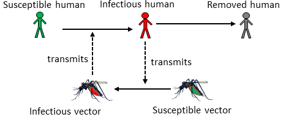

Not surprisingly, the IDs which receive the most study are those where one of the hosts are humans. The other host (i.e., the vector) can be any other animal, such as dogs, rodents, snails, insects, etc. At times, growth and replication of the pathogen occur mainly in one host, with the other just serving as a vessel to get between hosts. Most often, the pathogen completes significant parts of its growth and replication cycle in both (or all, if there are more than 2) hosts.

## Vector-borne transmission and ID patterns
Understanding what mechanisms lead to potentially observed patterns in incidence and prevalence for vector-borne diseases is difficult, due to the presence of more than one host. In a previous chapter, we discussed cycles that could be caused by the intrinsic transmission dynamics or influenced by external drivers (e.g., seasonal changes in weather). This general concept still holds, but there are now two species (e.g., humans and mosquitos),  both have distinct and intrinsic dynamics and responding differently to external factors. This obviously adds a lot of complexity to the model. Nevertheless, patterns in ID dynamics are often observed for vector-borne diseases and are at least partially understood. For instance, the reproductive cycle of mosquitos strongly depends on the weather, and specifically the availability or lack of water. As such, in regions that have strong differences in rainfall between seasons, one often observes annual cycles based on annual weather patterns. 

## Vector-borne transmission and interventions
With vector-borne ID, there is a unique opportunity for interventions that do not exist for directly transmitted diseases. Namely, we can try to control the ID at the vector stage. That often means trying to kill as many vectors as possible. DDT in the past and more recently pesticide-coated bed nets have been proven to work very effectively. Unfortunately, these interventions need to be sustained. Otherwise, mosquito numbers (or other vectors with a short lifespan) quickly bounce back. Also, while we mostly think of mosquitos and other insects as a nuisance or worse, they do perform important roles in the ecosystem, and it is unclear what the consequences would be of potentially killing all Anopheles mosquitos (they transmit a lot of important IDs). Some recent approaches try to make mosquitos resistant to ID. If one could introduce those and have them out-compete the mosquitos that are susceptible to the ID, one might - in theory - get rid of relevant IDs without affecting the ecosystem in unpredictable ways. 

A major problem with all control strategies targeting vectors is that not only do pathogens evolve quickly, but most vectors have fairly short life spans and large population numbers, which means rapid evolution. That could result in wide spread resistance making any control measures ineffective within a short time. Indeed, that was observed for DDT, where mosquitos resistant to the chemical started to appear before its widespread use was discontinued.

#### Modeling vector-borne transmission {#myadvancedbox}
The easiest way to model a vector-borne disease is to simply ignore the vector and assume that the transmission term of the equation (e.g., a term like _bSI_) represents -- in a very simplified form -- all the complicated processes involved in transmission, including the vector stage. That makes the model simple, but of course, doesn't capture the vector-borne aspects of the dynamics. If we are interested in the dynamics of the disease in all hosts, we do need to include the vector components in a model. To add vectors in a model, one could, for instance, build 2 SIR-type models, with one set of equations for the (human) host and one for the vector, and then couple the compartments by including transmission from humans to vectors and vectors to humans. Equations for such a model might look as follows:
$$
\begin{aligned}
\dot S_h &= - \beta_1 S_h I_v \\
\dot I_h &= \beta_1S_h I_v - \gamma_h I_h \\
\dot R_h &= \gamma_h I_h \\
\dot S_v &= - \beta_2 S_v I_h \\
\dot I_v &= \beta_2 S_v I_h - \gamma_v I_v \\
\dot R_v &= \gamma_v I_v
\end{aligned}
$$
Here, the index _h_ indicates humans and _v_ indicates vectors. The important vector-borne aspect of such a model is that transmission only occurs from hosts to vector and vector to host, not between hosts or vectors. In general, the above model needs to be modified to more accurately describe vector-borne ID dynamics. For instance, many vectors have a fairly short natural lifespan, and as such their births and deaths need to be included in the model, even if the timescale in which we investigate the model is short enough to allow us to ignore births and deaths for (human) hosts. It is common to include more details in the human part of the model (e.g., asymptomatic stage and others as discussed previously) and less detail for the vector part. The specific details that should be included are driven by the question one wants to study.

## Summary and Cartoon

Vector-borne transmission adds complexity to an ID, but also allows for a wider range of control measures (such as vector killing). 

 ](./images/xkcd-mosquito-ringtone.png)

## Exercises
* The _Vector transmission_ app in the DSAIDE package provides hands-on computer exercises for this chapter.
* Nominate an ID as a contender for having the 'craziest or most complicated' mode(s) of transmission. Explain the transmission dynamics for your nomination and justify why it deserves the title of _craziest or most complicated_. This doesn't have to be a vector-borne disease, though some of the "crazy" ones tend to use multiple hosts.

## Further Resources
* The following papers provide some additional discussion of vector-borne diseases and how to model them [@smith14; @kilpatrick12; @luz10].

## References

<!--chapter:end:160-VectorBorneID.Rmd-->

# Host Heterogeneity {#heterogeneity}

## Overview and Learning Objectives
In this module, we will briefly discuss the idea that hosts differ in characteristics that are important with regard to ID dynamics and control.

The learning objectives for this chapter are:

* Know the most common host characteristics that lead to heterogeneity
* Understand how heterogeneity might impact ID dynamics
* Evaluate the need to account for heterogeneity depending on setting
* Understand how different types of heterogeneity affect ID control

## Introduction
So far, we tracked hosts concerning their infection status (susceptible, infected, symptomatic, recovered, etc.). We assumed that hosts are similar enough with regard to any other characteristics that might matter for ID dynamics and control that we did not have to consider them. For instance, we did not account for age, sex, pre-existing conditions or any other such potentially differentiating detail among hosts.

That approach is of course at best a decent approximation and at worst completely wrong. Many characteristics affect how an ID interacts with a host. For instance, for many ID, children and the elderly are more likely to get infected and might suffer more severe symptoms. For other ID, only specific groups are affected. For instance, only sexually active individuals are at risk of contracting a sexually transmitted infection (ignoring for a moment less common transmission routes such as blood transfusion for HIV). We will discuss some of these differences/heterogeneities between hosts and how they affect ID transmission and control in this module.

## Types of Host Heterogeneity 
We generally only care about differences in hosts as they relate to the infectious disease process. Consider a simple - maybe silly - example: Almost no infectious disease study (none that I know of) cares about a person's hair color. That's because this characteristic has - as far as we are aware - no effect on the interaction of host and ID. On the other hand, a fundamental feature that affects many IDs is age. Therefore age often needs to be taken into account when studying IDs. Other important more broad categories such as genetics and behavior can also affect ID infection and spread.

Some host characteristics might only have an impact on a single component of the ID, e.g., the level of susceptibility to infection. Other host differences can affect multiple components, e.g., a person with numerous sexual partners is more likely to contract an STI, and if they are infected, they are also more likely to transmit an STI.

#### Host Heterogeneity Examples {#myexamplebox}
Several famous examples show how differences in genetics can impact ID. For instance, persons with a certain mutation of the CCR5 co-receptor on T-cells are much less likely to get infected with HIV. Similarly, persons with a particular mutation in the FUT2 gene are much less likely to get infected with norovirus. It is probable that there are genetic differences for almost any ID that influence the probability of getting infected, the severity of symptoms, and the duration and amount of shedding.

## Heterogeneity in Transmission: Core Groups
To study ID transmission dynamics, differences in the potential and ability of individual hosts to spread an ID are obviously of great importance. This idea of heterogeneity in transmission has been studied in several contexts and under different names. One of the first was the concept of a core group introduced to explain the persistence of gonorrhea in
the 1970s (see [@yorke78]). Core groups are subgroups in which transmission is higher compared to other groups. For many STI, transmission in the general population is low enough that the reproductive number is below 1. The question then is, why does that not lead to the extinction of the ID? The core group concept provides a reasonable explanation. Where a small but defined population of individuals maintain the ID with a reproductive number that is greater than 1. Infections spread from this group to those in the general population allows the ID to persist in the general population with a reproductive number less than 1.

Once we have identified that different groups have different transmission behavior, it also becomes necessary to understand how individuals belonging to one of the groups interact with people of the other groups. Often called the _mixing_ pattern between groups. We are most interested in the mixing and contact patterns that facilitate transmission of the ID under consideration. For instance, it is well known that humans tend to have more contacts with others of the same age, e.g., children predominantly contacting other children. This is called _assortative_ mixing, and such age-specific mixing is important for the transmission of many respiratory diseases. The opposite is _disassortative_ mixing. For instance, for STI, most mixing occurs between individuals from the opposite sex (and there are also more contacts among individuals of similar age). Therefore, for STI, mixing with regard to gender can be considered _disassortative_. However, it is also known that people who engage in risky sexual behavior (e.g., more partners per year) tend to have more contacts with others that engage in similar risk behavior, thus with regard to transmission and infection risk, STI often show _assortative_ mixing. If there is no mixing preference, it is called _random_ mixing. The _random_ mixing assumption is made implicitly in any model that does not account for contact/transmission heterogeneity, e.g., the basic SIR model assumes _random_ mixing and contact patterns between susceptible and infected, independent of any other characteristic. Determining the mixing patterns between individuals is important but also difficult. For some research in that area, see, e.g. [@edmunds06; @mossong08].

## Heterogeneity in Transmission: Superspreaders
An equivalent concept to that of the core group, but applied to individuals, is known by the term superspreaders. Superspreaders are individuals who spread/transmit an ID much more than the _average_ infected person. It turns out that for most ID, the number of secondary transmissions produced by the average infected person is not too meaningful. Such a measure would be a good description if the distribution of secondary infections were close to normal (or Poisson), with most infected individuals infecting similar numbers of others. However, what is often observed is a heavily skewed distribution, with most individuals infecting none or only a few others, and a few individuals infecting many others [@galvani05].

## Heterogeneity and The Reproductive Number
If we have multiple host types, we need to extend the idea of the reproductive number. While it is possible to compute a reproductive number for the overall population, this quantity might not tell the full story. Instead, we might want to look at the reproductive number for subsets of the population, for instance for the general population (non-superspreaders) and core groups (the superspreaders). If one wants to compute an overall reproductive number, one needs to account for the population heterogeneity by including a measure of the variability of contacts in the equation for the reproductive number. See, [@may01] for a discussion of this topic.

## Heterogeneity and ID control
Heterogeneity among hosts concerning their susceptibility, infectiousness, and severity has direct implications for control. If we know who is most likely to transmit, who is most likely to have a severe case of a disease, and who is most likely to catch an ID in the first place, we can implement targeted control strategies. For instance, instead of vaccinating people at random, we could target those that are most vulnerable to getting the ID, or those most likely to infect others if they were to get infected. The better we can target the intervention, the more impact they can have, and while also getting more 'bang for our buck'.   

## Modeling Heterogeneity
The basic concept of including host heterogeneity in models is relatively straightforward. We stratify the population according to the characteristic we want to take into account. For instance, instead of lumping everyone into susceptible-infected-recovered categories, we can track males and females, or children and adults, separately. Figure \@ref(fig:heterogeneity) illustrates this. 

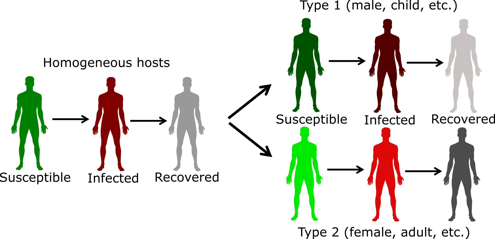

(\#fig:heterogeneity)Example of including host heterogeneity in an SIR model.

The challenges with including more details in the model are not conceptual but are instead logistical and potentially technical. Bigger models are harder to formulate, implement, and analyze. Additionally, we need estimates of model parameters with regard to the stratifying characteristics, which are often hard to get. Because of that, it is often best to start with a simple model, and slowly introduce host characteristics as they are deemed relevant to the ID setting, and question one wants to address. 

At some point, if we want to include a lot of detail, it might be worth switching the modeling framework. For compartmental models, hosts are grouped according to characteristics. As we want to track more characteristics, the number of compartments we need to include increases. If the basic model has C compartments/variables, P parameters, and we model N subpopulations, we have C x N equations and at least P x N (or more) parameters. For instance, if we had a basic SEIR model (4 compartments), and wanted to track males and females in 4 different age groups, we had 4 x 2 x 4 = 32 compartments. If we had additional compartments to follow say vaccination or treatment status, one could end up with more than 50 compartments, sometimes even going into the hundreds.

Once the number of compartments gets too large, it might then be worth deciding to stop using compartmental models and instead switch to a type of model that is called agent or individual-based model (ABM/IBM). In such models, the individual host is modeled and tracked. We can give everyone as many different characteristics as we want. This makes the model very flexible and potentially very realistic. The downside of these ABM is that they tend to be more complicated than compartmental models, are generally much harder to code, and often take a long time to run, especially if one wants to model a large population. Further, for detailed models, lots of parameter estimates are needed, and they are often not available, leading to potentially large uncertainty in model predictions. Also, it 's hard to make any statistical inference with ABM. Because of these disadvantages, the compartmental modeling framework is still the most frequently used and a good starting point for most situations and questions. For IDs where we know a lot and want detailed predictions (e.g., influenza), ABMs are becoming more common. 

## Summary and Cartoon
This chapter provided a brief discussion of host heterogeneity, how to consider it in studies, and its impact on transmission and control. We also discussed how to include heterogeneity into models.

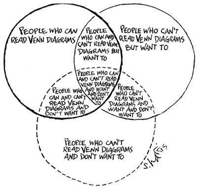

(\#fig:crazyvenndiagram)That is the best heterogeneity cartoon I have - let me know if you know a better one!

## Exercises
* The _Host Heterogeneity_ app in the DSAIDE package provides hands-on computer exercises for this chapter.
* Read the article "Disease spread, susceptibility, and infection intensity: vicious circles?" by Beldomenico and Begon [@beldomenico10]. The paper mostly discusses non-human IDs. Find evidence from human IDs for which the different components they discuss (variable host susceptibility, variable infection intensity, feedback circles in the individual/population level) might be applicable. 

## Further Resources
* Good further discussions of the superspreader concept can be found in [@galvani05; @lloyd-smith05; @stein11].
* The impact of host heterogeneity on the reproductive number is for instance discussed in [@may01], an application to Chlamydia is provided in [@potterat99].
* An influential study that collected detailed information on contact patterns using a diary approach is [@mossong08].
* General discussions of transmission heterogeneity are given in [@matthews05; @paull12].
* Host heterogeneity and control is for instance discussed in [@yorke78; @woolhouse97].

## References

<!--chapter:end:165-HostHeterogeneity.Rmd-->

# Infectious Disease Control

## Overview and Learning Objectives
This chapter provides a closer look at different types of control against infectious diseases and their potential outcomes.

The learning objectives for this chapter are:

* Know the major types of ID control strategies 
* Evaluate the use of different ID control strategies
* Understand how different pathogens require different types of control

## Introduction
Generally, the reason why we study IDs and their dynamics is to eventually _do something_. We want to implement control and intervention strategies to minimize disease burden. That could be trying to contain an ongoing outbreak, reduce the incidence of an endemic disease, or try to eradicate a disease. Depending on modes of transmission, infectiousness profiles and other ID characteristics, the types of interventions that are available and potentially useful will vary. Therefore, the better we understand and ID, the better we can likely implement control.  

## Goals of ID Control
When trying to control an ID, we often have more than one goal in mind. The following are a list of (overlapping) public health goals that we often try to achieve with ID control:

* Reduce morbidity
* Reduce mortality
* Reduce transmission
* Reduce incidence/prevalence
* Reduce economic impact
* Minimize ethical or moral dilemmas
* Protect the individual
* Protect the population

Most of these goals are overlapping. E.g., reducing transmission likely reduces overall morbidity and mortality. Sometimes, goals can be conflicting. For instance, if we have limited resources, should we target those that are most likely to transmit but not suffer much from the disease (e.g., children) or target those that are most likely to experience morbidity/mortality but are not that necessary for transmission (e.g., elderly)? Similarly, at what level is it acceptable to force people to (not) do something (e.g., forced vaccination or quarantine) that might not help - and maybe even slightly hurt - the individual, but will be beneficial to society? Answers to those questions are usually beyond the scope of just ID Epidemiology. What we can contribute to the wider discussion is an assessment of the impact of various control strategies. That information can then be combined with other considerations to make decisions.

## Types of Infectious Disease Control
The types of control and intervention strategies that exist for a given ID vary. Some depend on the route of transmission. Others depend on our skills and ability, e.g., our ability to produce a vaccine. The following sections describe the major types of ID control. 

### Vaccination
Vaccines are arguably the most cost effective public health intervention we have. An ideal vaccine is one that has only to be given once to induce lifelong protection against the ID. It should also be safe, with little to no side effects. Other characteristics of a good vaccine are ease of administration, low price and easy to transport and store.

The only IDs we have been able to eradicate so far (smallpox and rinderpest) are those against which we have good vaccines. Unfortunately, a good vaccine alone does not mean eradication is likely. Measles is a good example. We have a good vaccine, but the pathogen is so highly transmissible that coverage would need to be at levels beyond those currently achievable.

### Pharmaceutical Interventions (Drugs)
Drugs, most notably antibiotics, are another very effective means of combating ID. While vaccines try to prevent infection, drugs usually try to prevent symptoms (morbidity and mortality) in already infected individuals. Reduction in symptoms might or might not impact transmission dynamics. A good example where treatment reduces infectiousness and transmission is ART treatment for HIV infected individuals.

While not commonly used, drugs can also be given to susceptibles as prophylaxis to reduce the risk of infection. As such, one can think of drugs as short-term vaccines though the mechanism of protection is very different. Again, HIV is a case in point, where pre-exposure prophylaxis with ART has recently been shown to be somewhat effective in reducing the risk of infection.

For some IDs, such as, helminth infections, mass drug treatment is also being used to try and reduce ID prevalence enough to interrupt transmission and potentially eliminate the ID.

### Non-pharmaceutical Interventions 
These are the oldest types of interventions and are often quite effective. Quarantining of either infected or susceptibles prevents further transmission. Quarantine alone does not help those that are already infected. Though if quarantine occurs in a medical setting, targeted help for the sick might reduce their morbidity and mortality. A prominent recent example for the use of quarantine was during the 2014 Ebola outbreak in West Africa. No drugs or vaccines were available, and quarantine was the main control strategy. 

These days, strict quarantine can be hard to enforce, especially for diseases that are not as severe as Ebola. A broader class of intervention strategies, of which quarantine is a strong form, often goes by the name of _social distancing interventions_. E.g., closing a school to stop an ongoing flu or measles outbreak would usually not be labeled as quarantine, but would be considered _social distancing_. In general, social distancing interventions try to reduce mixing of infected and susceptible people, usually without going as far as fully isolating/quarantining individuals. This makes the intervention both less effective and less restrictive. Finding the right balance between restricting individual freedoms and protecting society can be difficult. 

Another non-pharmaceutical intervention that has a profound long-term effect is sanitation. By ensuring individuals have access to clean water, and waste is properly disposed of, the incidence of many ID dramatically drops. In fact, better living conditions resulted in reduced incidence for almost all IDs,  in Europe and North America even before the introduction of antibiotics. These are commonly called diseases of poverty.  

While usually not considered ID interventions, a general improvement in health (e.g., better nutrition), living conditions (e.g., better housing) and health literacy (better education) are known to be very effective at reducing the burden of any disease. Unfortunately, such systemic interventions are among the hardest to achieve.

### Special Interventions for Non-human Hosts
If one of the hosts is not a human (e.g., a mosquito vector, or some other animal), it is possible to use interventions that are not feasible for humans. Widespread killing of mosquitoes is ethically acceptable (though often not too effective). The killing of mammals, e.g., culling of dogs in certain parts of the world to prevent the spread of rabies or other diseases, is more controversial. For some animals, ethical concerns are usually not too great (e.g., killing of poultry), but economic implications can be huge.

## Characteristics of Interventions
In addition to grouping interventions into specific classes as done above, it is also useful to think about them in terms of their overall characteristics.

__Temporal/timing characteristics:__ While some interventions are permanent or long-term, e.g., vaccines, sanitation, improved living standards, other interventions are short-term, such as drug treatment or quarantine. In general, those interventions with lasting effects are preferable. However, those are also often the most expensive and difficult to implement.

__Target group characteristics:__ Another way to distinguish ID interventions is by the target group. Vaccines are ideally given before someone becomes infected with the ID. Drugs, on the other hand, are usually given to infected persons (though pre-exposure prophylaxis is sometimes used, e.g., for HIV or flu during a pandemic). Quarantine can be applied to either susceptibles or infected. Measures such as sanitation improvement affect everyone.

__Impact level characteristics:__ By that, I refer to the primary target being the individual or the population. The primary goal of drugs is to help the individual - population level effects as discussed earlier are secondary. In contrast, quarantine primarily targets population level impacts. It might not help an individual infected host if they are quarantined (though ethically, they should receive whatever support can be provided). Vaccines are also primarily meant to help protect the individual getting the vaccine. However, the effect of good vaccines is so powerful that in planning vaccination strategies, secondary population level effects due to herd immunity are nowadays taken into account. Interventions such as sanitation almost always target whole populations (e.g., a village/town/country).

Of course, for many interventions, these categories are not clear-cut and overlap. Still, it is conceptually useful to think about interventions in such broad categories. By looking at all the tools available and assessing their impact and feasibility, one can try to come up with the best strategy for a given ID and scenario. Such a best strategy will often involve using more than one method.

## Impact of Interventions
We discussed previously that to eradicate a disease (or prevent local outbreaks) one has to get the effective reproductive number to just a bit below 1 (of course the lower and closer to 0, the better). The level of population protection at which R=1 is called critical herd/population immunity level. The relation between original/basic reproductive number, intervention coverage, and effective R is R= R~0~(1-p). That's true if we assume that the intervention fully protects those to whom it is applied. If instead, the intervention is not perfect, we have R=R~0~(1-e*p), where e is the effectiveness of the intervention (e=1 is a perfectly effective intervention). 

By discussing intervention coverage, we assumed that the intervention was applied to the susceptibles. However, the same idea also applies if the intervention is applied to infected. Recall that the reproductive number is given by $R = D \beta S$. Reducing the fraction of susceptibles by some intervention reduces _R_. But we can also reduce _R_ by reducing the duration of the infectious period, D, or the infectiousness/rate at which an infected transmits, $\beta$. Quarantining infected is a strategy to reduce $\beta$, drugs sometimes can reduce _D_ and $\beta$. For instance, if we can reduce the duration of the infectious period in the average infected person by _p_, we get a new effective reproductive number $R_{e} = D(1-p) \beta S$. Obviously, the best strategy is one where we reduce the duration of infection, transmissibility, and number of susceptibles by some fraction, thus leading to a potentially large reduction in _R_.

## Interventions and Models
Studying the potential impact of interventions is probably the single most important current use of ID models. It is often simply not possible to do field studies or experiments to test the impact of specific intervention strategies. Such field studies would take a long time, be very costly, be logistically hard to do, and often be simply unethical: We can't introduce Ebola into a population, just to see how effective different intervention strategies might be! Thus, we rely on modeling to investigate hypothetical scenarios.  Models are relatively easy and quick to build and analyze (at least compared to real field studies), there are no ethical problems, and we have 'full control' over the whole system and 'know everything'. The hope is that if our models are decent approximations of the real world, we can make informed decisions and prepare for future outbreaks.

## Summary and Cartoon

## Exercises
* The _ID Control_ app in the DSAIDE package provides hands-on computer exercises for this chapter.
* Read the article "Towards the endgame and beyond: complexities and challenges for the elimination of infectious diseases" by Klepac et al. [@klepac13]. Choose some ID - either one listed in box 1 of the paper or a different one - and discuss the current plans for elimination/eradication. What features of the ID will likely be helpful or unhelpful with regard to eradication/elimination? Reference the different areas the paper discusses? What is your overall assessment of feasibility?

## Further Resources
* The relatively new Dengue vaccine raises interesting questions regarding the interplay of vaccination coverage and disease severity and is analyzed for instance in [@ferguson16].
* A brief discussion of ID control is provided in [@halloran14].

## References

<!--chapter:end:170-IDControl.Rmd-->

# Infectious Disease Surveillance

## Overview and Learning Objectives
In this module, we will take a look at surveillance of different infectious diseases.

The learning objectives for this chapter are:

* Understand surveillance 

## Introduction
To be able to implement successful interventions, we first need to know what is actually happening. Once we implemented a control strategy, we also want to know how it works. For both of those goals, good surveillance is key.

## Goals of Surveillance

* Identify new emerging diseases as quickly as possible

## Types of Surveillance
Active and passive

Medical/clinical and sequence

Ongoing or ad-hoc

## Problems with surveillance
Knowing numerator and denominator. Bias due to getting more severe cases. Behavior change during an outbreak.

#### Biased Surveillance - an example {#myexamplebox}
During the early days of the 2009 H1N1 influenza pandemic, the numbers on cases and deaths suggested that this strain of influenza might have a higher than normal case fatality ratio (the often used term case fatality rate is a bad label as this is not a rate). Once more and better data became available. It was realized that many infections initially did not get reported, and adjusting for those it became clear that the ratio of deaths to infected was thankfully not much different from seasonal influenza.

## Summary and Cartoon

## Exercises
* 

## Further Resources
* 

## References

<!--chapter:end:175-IDSurveillance.Rmd-->

# Dynamics of Multiple Pathogens

## Overview and Learning Objectives
In this chapter, we will discuss scenarios where more than one infectious disease is considered simultaneously.

The learning objectives for this chapter are:

* Know important multi-ID systems
* Understand how IDs can interact

## Introduction
So far, we focused on a single ID at a time. The main reason for this is simplicity. A single ID is already difficult to study and leads to complex dynamics. It makes sense to first study and understand individual IDs before including further IDs. That said, there are always many pathogens present at the same time, and infection with more than one ID is very common [@petney98]. This is true in the developed world with a fairly low ID burden, and even more so in developing countries. It is thus often useful to consider systems with more than one ID.

## Interactions of ID
Sometimes, different IDs do not interact, i.e., being infected with one does not impact the susceptibility or course of infection for another ID. It is likely that some amount of interaction occurs for almost all IDs, mediated by the immune response or through other mechanisms such as a change in host behavior or host death [@rohani03]. However, unless the IDs are relatively common and the interaction effect is strong, it is often hard to determine if and how IDs affect each other. As such, we know how some IDs interact (e.g., TB and HIV) but for most ID, we have very little knowledge. The next few sections briefly discuss some IDs for which we have some understanding regarding interactions. This is not an exhaustive discussion. Instead, we focus on some of the best-known interactions.

### HIV-TB Interactions
HIV is the pathogen that is best studied with regard to interaction with other pathogens [@karp07; @karp07a; @griffiths11]. Arguably of most public health interest and concern is the interaction with TB. Having an (untreated) HIV infection makes it much more likely for an individual latently infected with TB to develop TB disease. Further, once TB disease develops, an individual who is also infected with HIV has worse symptoms and a much higher chance of dying [@pawlowski12]. An important current question that is still not fully answered is if the suppression of HIV by antiretroviral therapy treatment removes all detrimental effects of HIV on TB progression, or if the presence of HIV, albeit at minuscule levels, still has a negative impact on TB disease progression.

### HIV-Hepatitis Interactions
Persons infected with HIV are also often at risk of having HBV or HCV infections. The primary reason for this is that risk factors for these pathogens are very similar (e.g., drug use) [@sulkowski08]. Co-infection leads to faster rate of liver failure [@chen14]. If HBV or HCV leads to more rapid progression to AIDS and HIV-mediated death is unclear [@kim09]. It seems that with antiretroviral therapy and the new drugs against viral hepatitis, the impact of this co-infection on health can be minimized.    

### Influenza-Strep Interactions
The interaction of influenza with some bacteria and most notably _Streptococcus pneumoniae_ has been somewhat well studied [@mccullers06]. Some careful animal experiments, as well as modeling studies,  have shown how influenza interacts with bacteria co-infections [@smith14a; @shrestha13]. In general, an influenza infection seems to make it more likely - during a short time window - to have a subsequent bacterial infection, and the outcome of the bacterial infection is often worse. It is still not well understood if there is also an effect of a respiratory bacterial infection on a potential secondary influenza infection [@davis12].

## More Than Two Infectious Diseases
While not much is known about interactions between any two ID (apart from the examples just described and a few others), even less is known for 2+ ID. It is fair to say that given our current level of knowledge about the biology and epidemiology of various ID, understanding interactions and dynamics of multiple ID is beyond our current scope, and will likely remain so for a while.

## Multiple ID and Control
If multiple IDs are present, it makes sense to try and implement control strategies against as many of them as possible. This is true for diseases which interact or are independent. Unfortunately, given the way health systems are structured and funded, it is still often the case that interventions target a single ID at a time. E.g., a campaign against malaria focuses solely on malaria treatment, even though many of the patients probably also have TB or some helminth infections and should be tested and treated for those diseases at the same time. The one important exception is HIV. Often HIV testing and treatment is included even if a study or health campaign focuses on a different disease. Having a more wide-spread multi-ID approach to control would very likely be highly effective since, for many ID, individuals who are likely to get infected with one are also likely to get infected with other ID. This is because many IDs have the same risk factors for transmission from poor nutrition or unsanitary conditions to particular behaviors that increase the risk for multiple IDs. One could, therefore, efficiently find and effectively treat many different IDs. Public health is slowly moving this direction.

Some ways in which multiple IDs are controlled are almost accidental. It is well known that better education, better nutrition, better standard of living, improved sanitation and housing all reduce morbidity and mortality to a large number of diseases. As developing countries become richer and people escape extreme poverty, the incidence of many IDs fall. This is the trajectory many developed countries were on, e.g., TB incidence in Europe was falling rapidly even before the introduction of anti-TB drugs. As more countries become developed, the ID burden will decline (and likely with it, "wealth diseases" like obesity will rise).

#### Modeling multiple ID {#myadvancedbox}
The approach to modeling multiple ID is similar to that of host heterogeneity: We need to split/stratify the population according to infection status of each ID. The complicated part is modeling any potential interactions between IDs correctly.
As mentioned previously, more compartments the more complex the model becomes. Making it harder to code,  analyze, and we need estimates for each parameter, which are often hard to get. Because of that, considering/modeling more than 2 ID is still almost never done - but many critical 2-ID modeling studies exist. Figure \@ref(fig:coinfection) shows the diagram for a 2 ID model. 

(\#fig:coinfection)Example of a model that considers 2 ID.

The differential equations corresponding to this diagram are given by:

$$\dot S =  -  (b_{1} (I_1+I_{1X}) + b_{2} (I_2+I_{2X}) + b_{12}I_{12}) S  $$ 
$$\dot I_1 =   (b_{1} (I_1+I_{1X}) + ab_{12} I_{12})S - (g_1  + b_{2} (I_2+I_{2X})  + b_{12}  I_{12}) I_1$$ 
$$\dot I_2 =   (b_{2} (I_2+I_{2X}) +  (1-a) b_{12} I_{12})S - (g_2 + b_{1}(I_1 + I_{1X}) + b_{12} I_{12}) I_2$$ 
$$\dot I_{12} = (b_{2} (I_2+I_{2X})  + b_{12}  I_{12}) I_1 + (b_{1}(I_1 + I_{1X}) + b_{12} I_{12}) I_2  - g_{12} I_{12}$$ 
$$\dot R_1 = g_1 I_1 - (b_2 (I_2 + I_{2X}) + b_{12}  I_{12}) R_1$$
$$\dot R_2 = g_2 I_2 - (b_1 (I_1 + I_{1X}) + b_{12}  I_{12}) R_2$$
$$\dot I_{1X} = (b_1 (I_1 + I_{1X}) + b_{12}  I_{12}) R_2 - g_{1} I_{1X}$$
$$\dot I_{2X} = (b_2 (I_2 + I_{2X}) + b_{12}  I_{12}) R_1 - g_{2} I_{2X}$$
$$\dot R_{12} = g_{1} I_{1X} + g_{2} I_{2X} + g_{12} I_{12} $$

## Summary and Cartoon
This chapter discussed multi-pathogen systems. 

## Exercises
* The _Multi-pathogen dynamics_ app in the DSAIDE package provides hands-on computer exercises for this chapter.
* Read the article "The nature and consequences of coinfection in humans" by Griffiths et al. [@griffiths11]. They report that for several of the "top 10" ID no co-infection studies could be found among 2009 publications. See if you can find any coinfection studies on one of those IDs that were published since. Describe and summarize the studies you found.

## Further Resources
* The references mentioned in this chapter provide further information on specific topics.
* An interesting modeling study looking at potential interactions of HIV and Malaria is [@abu-raddad06].
* A review of possible interactions between TB and parasitic infections can be found in [@li13].
* A very nice analysis of the impact of measles and measles vaccination on other childhood infectious diseases is given in [@mina15]. 

## References

<!--chapter:end:190-MultiPathogenID.Rmd-->

# Stochastic Dynamics and Extinctions {#stochastic}

## Overview and Learning Objectives
In this chapter, we take a look at stochasticity and how it impacts ID dynamics. A focus is on the potential of ID extinction. We discuss how one needs to account for stochasticity in models if one wants to study extinction. 

The learning objectives for this chapter are:

*    Understand the difference between stochastic and deterministic models
*    Know when one needs to make use of stochastic models
*    Understand the concept of critical community size
*   Understand how stochasticity affects ID dynamics and can lead to extinctions

## Introduction
So far, all the models we have used to explore different aspects of ID dynamics have been _deterministic_. For a deterministic model, once you choose the initial conditions and parameter values, you always get the same result, no matter how often you run the model. There is no randomness present. Biological systems are never deterministic. There is always some amount of randomness or noise present. Models that allow for such randomness are called stochastic models. We discuss here when it is important to consider stochastic models and some of the questions one can only study with those models.

## Deterministic systems
Such deterministic models are relatively easy to implement and to study. That is one of the reasons they are so commonly used. Such a modeling approach also often provides a good representation of the dynamics of real ID if numbers are large. That is due to the law of large numbers. While every individual host or pathogen undergoes somewhat random dynamics, these random parts get _averaged out_, and the dynamics of the whole population is fairly predictable and well described by such deterministic models. (This is the same concept we use in classical epidemiological studies, where we enroll sufficiently large numbers such that we can say something predictable about differences between groups, even if individuals are somewhat unpredictable.)

## Stochasticity
Biological systems are never deterministic. When numbers are small, randomness starts to matter. As an example, consider an outbreak of some ID. Let's say we have a group of 100 infected. At a given time, some of them will transmit to others, and after that, they will recover from the disease, while others will recover before infecting others. The overall outbreak dynamics can be well approximated by a deterministic model if we accurately specify the average rate of transmission and the average rate of recovery. In contrast, now assume that there is a single infected person. Now it makes a huge difference if this person transmits to someone else before recovering, or if they recover before transmission occurs. In the latter case, the outbreak is over, and the ID has gone extinct. Thus, at small numbers, randomness/unpredictability in the order of events can make a large difference. 

## Discrete Numbers and Extinctions
Another problem inherent in the deterministic differential equation based models we have looked at so far is that they treat individuals in each compartment as continuous. For instance, the models allow 142.7 infected hosts. Of course, in reality, those numbers have to be integers. If we are dealing with large numbers, the difference between 142.7 and 142 or 143 is minor and doesn't matter. However, once numbers get small, the fact that we are dealing with discrete numbers of hosts becomes significant. So once less than 1 host has an infection the ID is in reality gone, but a continuous model would instead allow the number of infected to drop below 1 but remain above 0. In this way, the ID in the continuous models never actually goes extinct, it only gets closer and closer to 0 (and at some point is so close to 0 that the computer can't distinguish it from 0 anymore).

## Modeling Stochasticity and Extinction
To capture both the randomness and discrete nature of real systems requires a slightly different modeling approach. We can still use compartmental models, i.e., we track total numbers of individuals in particular states (e.g., S-I-R). But now, instead of letting the numbers in each compartment change continuously through inflows and outflows, changes happen in discrete steps, determined by specific events that occur in a probabilistic manner. 

As an example, instead of new susceptible hosts entering the system at some continuous birth rate, we now model births occurring as discrete events. Each birth event leads to an increase in the number of susceptibles by 1. 
The timing of the birth events is somewhat random, with an overall probability determined by the model (e.g., a higher birth rate will mean births occur more frequently, but still randomly). 

## Factors Affecting Extinction
Extinction of ID is of interest because that is often our final goal. We would like to drive an ID to extinction, either locally or even better, globally. If and how an ID can be driven to extinction depends on different factors. For IDs in humans, the only real chance is to tackle those with no other hosts or reservoirs. As such, we will likely never be able to eradicate influenza. But measles eradication might be possible (though hard).

Factors related to the host population and distinct ID characteristics influence the likelihood of an ID to go extinct. Two significant population factors are the size of the host population and the speed at which new susceptible hosts are replenished. Important characteristics of the ID included the infectiousness, the duration of the latent and infectious periods, the ability of the ID to persist outside the host, and other.

## Critical Community Size
The minimum size of a population at which an ID can maintain itself in a population without extinction has been termed the Critical Community Size (CCS) (this also depends on the replenishment of new susceptibles, e.g., birth rates). Studies for measles suggested that the CCS was several hundred thousand [@keeling02], meaning that measles could have only become a human pathogen once human populations were large enough to maintain it. The CCS is the number of susceptibles in a population and does not include those who are immune. Through vaccinating it is possible to reduce the size of the susceptible population below the CCS. So it is not necessary to vaccinate everyone to get an ID to go extinct. We just need to reach enough individuals to get the population of susceptibles below the critical level. This task is already hard by itself, as evidenced by the fact that we have not been able to eradicate measles, despite having a good vaccine.

## Host Extinction
Another way an ID can go extinct is if its hosts go extinct - either due to mortality from the ID or other causes. 
For most human diseases, such host extinction is fortunately not very common - though highly lethal ID such as Ebola can lead to marked reduction in the number of hosts in a given population. For non-human disease, extinctions of hosts due to disease is a more significant issue. Here, conversation efforts might try to achieve non-extinction of the host and - ideally - extinction of the ID. 

The host extinction approach is also often considered and used for vector-borne diseases. Here, the idea is to drive one of the hosts (commonly called the vector) to extinction. The obvious reasoning is that if there are fewer vectors (e.g., mosquitoes), the chances for humans to get infected are lower. Widespread use of DDT or insecticide-coated bed-nets are examples of this. A similar but more controversial approach is the attempted control of rabies in humans by killing its primary host, vampire-bats [@stoner-duncan14].

## Disease Emergence
The flip-side of extinction is the emergence of a new disease. During extinction, infected/pathogen numbers move from a level that can be decently approximated by a deterministic model to numbers so small that it requires a stochastic analysis approach to allow the possibility of extinction. During emergence, the new disease starts at zero, then is introduced in modest numbers (possibly only a single introduction) into a new population, and "bounces around" for a while in small numbers. If conditions are right (i.e., local reproductive number greater than 1), the disease might take off and spread. It might eventually reach high enough numbers that a deterministic approximation which focuses on the mean dynamics is warranted. To understand emerging infectious diseases, one needs to account for evolutionary dynamics. Both are an important topics in infectious disease epidemiology and will considered in detail in the next few chapters.

## Are stochastic models better?
After having gone through this chapter and learned that stochastic models allow you to address questions that deterministic models cannot address, you might wonder why we should still use deterministic models at all. The main reasons are that deterministic models are generally easier to build, easier to analyze, faster to run on a computer, and importantly, much easier to fit to data. Often this simplicity is worth the loss in some level of realism. But of course, it depends on the specific scenario and question. Recall the example of different maps in a chapter \@ref(idstates). The right map depends on the question. Similarly, the most appropriate model depends on your question. For some questions, stochastic models are needed. For others, deterministic models might still be the better choice.

## Summary and Cartoon
This module provides a brief discussion of stochasticity in ID dynamics, and its relation to disease extinctions.

(\#fig:smallpox)Smallpox is _almost_ extinct.

## Exercises
* The _Stochastic dynamics_ app in the DSAIDE package provides hands-on computer exercises for this chapter.
* Read the article "Measles Endemicity in Insular Populations: Critical Community Size and Its Evolutionary Implication" by Black [@black66]. The paper discusses critical community size for measles. Find 2 papers/analyses that discuss the CCS for other IDs. Read, summarize and critique the papers.

## Further Resources
* Some further analysis of critical community size and measles can be found in [@bartlett57; @bartlett60; @keeling97; @keeling97a].
* Some further discussion of stochastic epidemic models can be found in [@black12; @britton10].
* A broad discussion of invasion and persistence of ID and the role of stochasticity is given in [@lloyd-smith05b].
* An interesting discussion of critical community size and its dependence on birth dynamics, especially birth pulses, is provided in [@peel14].

## References

<!--chapter:end:200-StochasticDynamics.Rmd-->

# Evolutionary Dynamics Introduction

## Overview and Learning Objectives
In this chapter, we will take a look at the evolutionary dynamics of infectious diseases. 

The learning objectives for this chapter are:

* Understand the central mechanisms and drivers of infectious disease evolution 
* Be able to assess how different control strategies can affect infectious disease evolution

## Introduction
Evolution is based on the generation of diversity, usually genetic diversity through mutations and the subsequent increase or decrease in certain genetic variants through selection or random drift. Microorganisms, especially viruses, tend to undergo rapid evolutionary change. High mutation rates and large population sizes provide many opportunities for the generation of genotypic and phenotypic diversity. Short generation times and fluctuations in population size (e.g., through transmission bottlenecks) allow selection to quickly act on this diversity, amplifying those mutants that have a fitness advantage and eliminating those with low fitness. These features of microbial populations often lead to rapid evolutionary changes. Such evolutionary change can become a public health problem. 

## Basics of Evolutionary dynamics
Two main mechanisms underly evolutionary dynamics: First, diversity needs to be generated. 

Second, newly created mutants undergo _selection_. Depending on the phenotype of the mutant and the environment, it might be more or less fit than the wild-type (e.g. grow better inside a host or transmit better between hosts). Depending on this fitness

Another process is drift. Even if a mutant has lowe or higher fitness than the wild-type.

These two processes are often labeled 'mutation' and 'selection'. In that terminology, mutation includes processes such as point mutation, recombination, etc.

The mutation process is generally stochastic, new mutants are generated at random. For most organisms, this also occurs at a fixed rate, independent of the setting. An exception are some bacteria that are thought to be able to increase generation of new mutants in response to environmental factors REFS.

The selection process is potentially less random and more predictable. 

In general (apart from the possible phenomenon of drug-induced hypermutation in bacteria), the generation of genetic variants is not influenced by any human intervention. Those mutants are constantly produced. In the usual setting, most mutants are less fit than the wild-type strain and therefore are outcompeted. If not, they replace the current strain and become the new wild-type. 

## Evolution and Immune Escape
A powerful driver of evolution is the host immune response. If an ID induces a strong immune response which subsequently protects the host from re-infection, a mutant of the ID which can partially escape the host immunity and infect a host will have a large fitness advantage. This is the process which drives the continuous evolution of influenza in humans. It is likely also the driver for changes in many other diseases, especially viruses. Why some pathogens do not seem to evolve much to circumvent immune response (measles is a good example) is not quite clear, though some studies have speculated on that topic [@frank07; @lange09].

## Modeling Evolutionary Dynamics
To study evolutionary dynamics, we will need to implement models that allow for changes in the system on top of the non-evolutionary dynamics of the ID. Unless we plan to model many different potential new variants, it is often easiest to pre-specify the number of variants we want to track. In the simplest form where we only track pathogen evolution, we might model the wild-type (normal, pre-existing) form of the pathogen and a single mutant that is different in some important characteristic, e.g., resistant to a drug or able to evade a vaccine. We would build a model with these compartments. We often also pre-specify the characteristics (i.e., the parameter values) for both the wild-type and mutant. We implement the process of mutant generation in the model and run the simulation. Under certain circumstances, we might see the mutant be generated and take over the population. 

If we want to model many different mutants, maybe allowing for random, not pre-specified, differences in their fitness, and perhaps even allowing for host evolution, the models get quite a bit more complicated. They are not necessarily conceptually harder, but there is more bookkeeping and coding involved making it technically trickier.

## Co-evolution
While the hosts infected by ID also evolve, this usually happens on much slower time-scales. As such, studying evolution by assuming only the ID evolves and not the host is often a good approximation. However, there are examples where host evolution needs to be considered. A good example is the introduction of myxoma virus to control Australian rabbit populations. Evolution of both the virus and rabbits was observed. Over longer time-scales, features such as sickle cell anemia, which comes from a mutation that is associated with reduced malaria morbidity, is likely a trait some humans evolved in response to malaria. A discussion of genetic characteristics in humans that might be attributable to evolution in response to specific infectious diseases is provided in [@pittman16].

## Summary and Cartoon
This module provides a brief discussion of ID-evolution, especially concerning ID control.

## Exercises
* The _Evolutionary dynamics_ app in the DSAIDE package provides hands-on computer exercises for this chapter.
* Read the article 'Evolutionary epidemiology 20 years on: Challenges and prospects' by Restif. The paper talks about 3 evolutionary patterns that are important to ID control. Find one or several papers that have been published in the last 5 years which address ID control from an evolutionary perspective of one or more of those topics mentioned in the Restif paper. Summarize and discuss the paper(s) you found. Critically assess the feasibility of the ideas put forward. 

## Further Resources
* The references mentioned in this chapter provide further information on specific topics.
* Some clever ideas to fight and prevent drug resistance have recently been proposed, see [@baym16].
* The interaction of co-infection (discussed in a previous chapter) and drug resistance is discussed in [@birger15].
* One of the primary goals in ID research is to be able to forecast the dynamics of ID, both on short and long timescales (similar to weather and climate forecasts). A review and discussion of that topic are in [@gandon16].  

## References

<!--chapter:end:210-EvolutionaryDynamics.Rmd-->

# Evolution and Control

## Overview and Learning Objectives
In this chapter, we will discuss how control of infectious diseases can induce strong evolutionary pressure and how this often leads to unwanted results.

The learning objectives for this chapter are:

* Understand how control measures affect pathogen fitness
* Assess the impact of different control measures on potential for evolution
* Know about similarities and differences in certain ID control strategies

## Introduction

Some of the most potent drivers of evolution are the very same control strategies we have developed to try to reduce the burden of an ID. The more powerful the intervention, the more evolutionary pressure a pathogen faces and the more advantaged a pathogen variant that is partially or entirely resistant to the intervention will be. 

The following sections discuss several drivers of public health importance that influence the selective fitness of different genetic variants and thereby drive ID-evolution.

What happens in the presence of interventions is that the fitness landscape changes. For instance, if we give a patient drugs, a mutant resistant to drugs with a fitness less than the wild-type in the absence of drug treatment has a significant advantage and can outcompete the wild-type strain.

## Vaccine Escape
Vaccines are some of our most potent interventions. Vaccination induces immunity in the vaccinated hosts. If a pathogen can circumvent immunity and infected vaccinated individuals, it will have a large fitness advantage. Therefore, any mutation that arises which allows a pathogen to reduce the impact of host immunity will likely spread through a population quickly. Most immunity works through antibodies. Thus pathogen variants that evolve not to be (or less) recognized by pre-existing antibodies have an advantage. This is the same mechanism induced by natural immunity. Thus, pathogens that frequently evolve to escape natural antibody-based immunity (e.g., influenza, HIV) are also able to develop resistance to vaccine-induced immunity. This is the reason we need to get re-immunized with influenza vaccines regularly and why we have not managed to develop an HIV vaccine. In contrast, an ID like measles which does not seem to be able to escape natural immunity also does not evolve resistance to the vaccine, and we can use the same vaccine against measles we have been using for decades. 

The reason why measles might not be able to escape binding by pre-existing antibodies is likely because the binding site is also the part of the virus that is needed to attach to and enter host cells. Any mutation evading antibody binding would also lead to an inability to attach to and infect cells. In contrast, for influenza, the antibody binding regions and the receptor attachment regions are somewhat distinct.

## Drug Resistance
Drugs are another mechanism that applies a strong selective pressure. Any pathogen that can avoid being killed by a drug can potentially 'take over' a patient and transmit to the next. If drug use is widespread in the population, those resistant mutants which generally have lower fitness than the wild-type, drug-sensitive strain can take over in a population. This phenomenon has been observed with many different ID and drugs and produced such looming public health problems as extensively drug-resistant TB (XDR TB) and methicillin-resistant Staphylococcus aureus (MRSA) [@levy04]. 
Since viruses tend to evolve faster than bacteria, drug resistance evolution is often a problem at the individual patient level. HIV is the prime example. Single-drug therapy for HIV fails consistently because the virus quickly evolved resistance. Only once we started using multiple drugs at the same time were we able to prevent rapid evolution. We are playing a 'numbers game' since the chance of 3 resistance mutations against 3 different drugs occurring is so small that it rarely happens during the treatment of an individual host, thus making the drugs effective for the host's lifetime.
Since drug resistance is such an important public health problem, it is widely studied. This includes many modeling studies. For an overview of some of those, see [@louz10; @temime08; @wiesch11]. 

## Summary and Cartoon

## Exercises

## Further Resources

## References

<!--chapter:end:214-EvolutionandControl.Rmd-->

# Emerging Infectious Diseases 

## Overview and Learning Objectives
In this chapter, we will take a look at the evolutionary processes underlying the emergence of new Infectious Diseases.

The learning objectives for this chapter are:

* Understand the central mechanisms and drivers of emergence 
* Assess the potential impact of different control strategies on potential future ID emergence

## Introduction
The definition of emerging infectious disease (EID) is a bit vague, but in general a pathogen that is 'new' to a specific population can be considered an EID. A 'new' pathogen can mean a genuinely new one (e.g. SARS or MERS-CoV in humans), or a new variant of an existing pathogen (e.g. the 2009 H1N1 influenza that caused a pandemic, or drug resistant Staph Aureus). In each case, there is usually a mix of deterministic drivers (e.g. changes in climate, population density, antibiotic use) and random chance that lead to the emergence of new diseases.

## Emergence and Evolution
The word 'emergence' describes what is observed, a new disease shows up for the first time (emerges) in a population. This emergence is almost always linked to evolutionary processes. For instance, a pathogen that is already in the human population evolves drug resistance. Or a new pathogen is introduced into the human population and then undergoes evolution to adapt to the new host. While one could define emergence as the phenomenon and evolution as the mechanism, in practice, you will often find these terms used interchangeably, and the exact meaning will depend on how the author defines it. In this chapter, we will discuss both the mechanisms of evolution and how they can lead to the emergence of new pathogens. The ability to understand and predict the emergence of new IDs is, of course, of vital importance, recent references providing additional information are [@brett17; @dibble16].

## Ecological drivers of evolution and emergence
Many external, ecological factors affect ID dynamics. Weather, climate, vegetation, the abundance and density of hosts and other species, nutritional status, and general living conditions are all important factors influencing human and animal ID. This is true both for short-term dynamics (e.g., weather patterns can affect disease incidence) as well as for the long-term evolutionary dynamics. The emergence of many new viral pathogens among humans (e.g., HIV, SARS, MERS) is likely caused by the closer contact humans have with the animals who are the main hosts of those diseases. Transmission in these situations of close human-animal contact is often called spillover.  Similarly, as discussed in the previous chapter, measles and other diseases were only able to emerge and establish themselves among humans once human populations became large enough. As global warming will affect climate and as people become more affluent and urbanized, we can expect further changes in ID dynamics and evolution over the next decades - though predicting what changes exactly will occur, and which diseases might increase and decrease in importance is very difficult [@altizer13].

## Emergence dynamics
During the process of emergence, the new disease is initially - by definition - not present (or at least not detectable by our surveillance methods). Initially a small number of new hosts are infected by the new disease. The disease "bounces around" for a while with few transmission events and overall low numbers. If conditions are right (the local reproductive number is greater than 1), the disease might take off and spread. Once it has spread enough that our surveillance systems notice it, we consider this new disease as having emerged in that population. The newly emerged (observed) disease can then either be brought under control relatively quickly (e.g. 2003 SARS outbreak), or with much effort (e.g. 2014 Ebola outbreak), or not be fully controlled but continue at a low level (e.g. MERS-CoV) or uncontrolled and spreading widely (e.g. 2009 influenza pandemic).

## Modeling ID Emergence Dynamics
To study evolutionary dynamics, we will need to implement models that allow for changes in the system on top of the non-evolutionary dynamics of the ID. Unless we plan to model many different potential new variants, it is often easiest to pre-specify the number of variants we want to track. In the simplest form where we only track pathogen evolution, we might model the wild-type (normal, pre-existing) form of the pathogen and a single mutant that is different in some important characteristic, e.g., resistant to a drug or able to evade a vaccine. We would build a model with these compartments. We often also pre-specify the characteristics (i.e., the parameter values) for both the wild-type and mutant. We implement the process of mutant generation in the model and run the simulation. Under certain circumstances, we might see the mutant be generated and take over the population. 

If we want to model many different mutants, maybe allowing for random, not pre-specified, differences in their fitness, and perhaps even allowing for host evolution, the models get quite a bit more complicated. They are not necessarily conceptually harder, but there is more bookkeeping and coding involved making it technically trickier.

## Summary and Cartoon
This module provides a brief discussion of ID emergence.

## Exercises
*  

## Further Resources
* A few nice overview articles are [@woolhouse02]

## References

<!--chapter:end:215-EmergingID.Rmd-->

# Virulence

## Overview and Learning Objectives
In this chapter, we will discuss the concept of virulence and how it can be understood from an evolutionary perspective. 

The learning objectives for this chapter are:

* Be able to define virulence
* Understand the drivers of virulence for specific diseases 

## Introduction
Many pathogens harm their hosts, some in small amounts (e.g. a runny nose), some in large amounts (e.g. death). The question of why that is the case is 

## Virulence definition
The term virulence is a bit fuzzy, but it generally means 'harm to the host'. That could be due to mortality caused by an ID, or in less severe forms, ID-related morbidity (sickness/symptoms).

## Virulence evolution
Pathogens 'don't care' about harming their hosts, their primary 'purpose' is to get in, replicate, and get back out and infect the next host. Sometimes, inducing some morbidity in the host is useful for the pathogen. Sneezing and coughing for respiratory infections might lead to enhanced transmission and therefore increased pathogen fitness. In other situations, inducing morbidity/mortality doesn't increase pathogen fitness, but it also doesn't decrease it. Therefore, selection doesn't act to change the number of symptoms induced. Pathogens that are too virulent, and in extreme cases kill their hosts, generally have reduced fitness since, in most situations, dead hosts do not transmit. The idea is then that pathogens evolve to induce the level of virulence that is optimal for their overall transmission fitness. 

## Summary and Cartoon

## Exercises

## Further Resources
* Ewald and colleagues have done some interesting investigations connecting transmission type to virulence/pathogenicity of specific diseases. See for instance [@ewald87; @ewald95].
* Introductory articles to the topic are e.g. [@levin96; @frank08]

## References

<!--chapter:end:218-Virulence.Rmd-->

# Networks and ID

## Overview and Learning Objectives
In this module, we will briefly discuss the concept of transmission networks and how that affects ID dynamics and control.

The learning objectives for this chapter are:

* Know the how to define and measure transmission networks
* Understand how different types of network structures affect ID transmission and control
* Understand how transmission networks affect disease spread
* Evaluate the impact of network structure on ID transmission

## Introduction
ID spread along _connections_ between infected and uninfected hosts. Those could be very close and defined connections, such as for sexually transmitted infections, or much less well-defined connections, such as a shared water or air source (e.g., cholera and influenza). If we want to account for these connections explicitly, we need to consider a conceptual framework that moves away from the compartmental approach. In the compartmental approach, all hosts with given characteristics (e.g., infected children) were lumped together, and no notion of connectivity was included. In contrast, a network perspective explicitly considers individuals and their connections. 

## Network Terminology
The basic building blocks of networks are entities and their connections. Those entities go by different, equivalent names, such as actor, node, vertex, site. Similarly, the connections have different, equivalent names, such as edge, link, bond, tie or connection. The different names stem from the fact that the network framework was developed independently in various scientific sub-fields.

## Network Nodes
Usually, the nodes are individual hosts (e.g., humans). But that does not have to be the case. Nodes can also represent entities such as schools, cities, hospitals, etc. Simple networks only have one type of node, and more complicated networks can have different types of nodes. For instance, humans can be connected to specific places where they meet.

In their simplest form, nodes are only characterized by their connections, and they don't have any other properties. In model simulations, it is possible to give nodes features such as age, gender, etc. and account for that when simulating ID spread.

## Network Connections
What constitutes a connection in a network strongly depends on the question asked and the ID under consideration. Sexual networks connect people that have some form of sexual contact that was sufficient to transmit the disease in question. Similarly, social contact networks consider contacts between individuals in a social setting that allows for the transmission of an ID, e.g., close contact for transmission of a respiratory disease. Proximity networks can be built based on people frequenting the same locations. Connections can either be simple or have characteristics, which describe the relationship that exists between nodes. For instance, connections can have weights, with stronger connections between people that have closer or longer contacts. Connections can also have directions. For instance, if we wanted to model cholera transmission and had a network of villages, then a village upstream would have a connection pointing to villages downstream, but not the reverse. In other words, an 'infected village' upstream can infect a downstream village, but the opposite does not occur.

## Network Characteristics
The initial study of a network often starts with the properties of the network itself, without considering any ID spread (yet). One of the most important characteristics of a network is the degree distribution of the nodes. This is simply a histogram of the number of connections that each node has. If connections have directions or there is more than one type of connection possible, then each one would have a histogram. 

Another network characteristic is the 'shortest path length', which measures the shortest distance of going from a particular node to some other node. Every node has a shortest path length to every other node (if 2 nodes are not connected because they belong to unconnected subparts of a network, the path length is considered infinite).

Many other network characteristics exist, the field of network analysis has proliferated in the last several years. If you want to learn more, [@newman13] is a useful resource. Many review articles on that topic also exist [@keeling05]. 

It is important to understand that some characteristics are attached to individual nodes and some to the full network. For instance, every node has a number of degrees (connections), and the network has an overall degree distribution. Similarly, one can compute the mean shortest path length for each node and, if one takes another mean, a mean path length for the whole network. 

## Important types of networks
There are several types or classes of networks with specific characteristics that have been studied in great detail, either because they are analytically tractable or because of their real-world importance.

One of the best-studied networks is the random network. In this network, any 2 nodes have a fixed probability of being connected. For a network of _N_ nodes and connection probability _p_, the average number of connections each node has (it's degree) is _(N-1)p_. The degree distribution of the network is binomial, which for large networks becomes a normal distribution. That means most nodes have approximately the average number of connections. There are only a few nodes with substantially fewer or more connections.

Many real-world networks do not have the degree distribution found for random networks. It is often common that most nodes have very few connections, while a few nodes have many connections. This idea, for instance, underlies the superspreader concept. Such a distribution of connections can be well described by a scale-free network. In which case the degree distribution follows a power law, with most nodes having very few connections but a small number of nodes having very many connections.

(\#fig:network-examples)Random and scale-free networks and degree distribution.

## ID Transmission on Networks
The premise for ID transmission is that it can only occur along the connections of a network. As such, the structure of the network can strongly influence the dynamics of the ID. How exactly different characteristics of networks, such as the one discussed above and others, interact with the features of the ID to affect overall ID dynamics is an area that is currently heavily investigated. For some recent work on that, see [@bansal07]. 

## Networks and ID Control
Knowing about the connection structure is necessary for ID control. Most obviously, if we are aware who the individuals are with many connections, we could target them preferentially and have a potentially larger impact compared to targeting random people. Other individuals that connect separate clusters of a network might also be prime targets. The challenge in real-world systems is to identify the individuals that should be targeted and being able to reach them, and in an outbreak situation, that would need to be done under time pressure. As such, while network theory has much to offer for control, it is still challenging to implement network-based intervention approaches in practice.

## Modeling ID Transmission on Networks
Building and analyzing network models of ID transmission is generally more challenging than the compartmental modeling approach. For networks, we usually track individuals and as such the model becomes an agent-based model caring all the added complexity associated with agent-based modeling. It is also somewhat harder to analyze the results. Still, networks are a much closer approximation of real systems and have therefore seen increased use in the ID modeling community in recent years. With an increase in available data of the 'network type' (geocoded cellphone data) further increases in computational power and more sophisticated and efficient analysis approaches, it is quite likely that network-based methods will continue to grow in importance.

## ID Transmission on Dynamic Networks
Most of the time, networks are considered static and do not change during the ID transmission process. However, this does not have to be the case and is often not realistic. The most detailed models allow for variations in the network through the making and breaking of connections and addition and loss (birth and death) of nodes. Implementing and analyzing models that have a dynamically changing network with the ID dynamics (and potential control measures) occurring 'on top' is technically challenging. Not too many of such models currently exist, but it is an area of active investigation by many, see [@bansal10].

## Summary and Cartoon
This module provides a brief discussion of transmission networks and how they impact dynamics and control of ID.

(\#fig:xkcdnetwork)Computer viruses and human viruses are in many ways similar. [Source: xkcd.com](https://xkcd.com/350/).

## Exercises
* The online game [VAX](http://vax.herokuapp.com/) provides a nice interactive setting where you can explore vaccination on networks and how it can help reduce disease spread. Try to pass all levels.
* Find a study that looked at the dynamics of an ID on a network. Summarize and discuss the study. Explain what findings in the study are due to the network approach. Discuss/speculate how results would be different if one were to ignore the network structure and instead used a compartmental model approach.
* Read the article "Networks and epidemic models" by Keeling and Eames [@keeling05]. Find a recent paper that investigates a network for some ID and explain which data collection approach of the ones mentioned in section 3 (or a different one) was used. Also, discuss the structure of the network that was observed in relation to the ones described in section 5.

## Further Resources
* Nice general introductions to networks are given in [@strogatz01; newman03]
* Further discussion of networks and ID spread are provided in [@pellis15; @pastor-satorras15; @ferrari11; @bansal07]
* Networks and ID control are for discussed in for instance [@salathe10].

## References

<!--chapter:end:220-Networks.Rmd-->

# Summary

This book provided an introduction to Infectious Disease Epidemiology from a modern, dynamical systems perspective. 

While the ability to be able to develop and analyze dynamical models requires additional training and skills in mathematics and coding, I hope that this book helped you to understand such a systems modeling perspective and different ID concepts best discussed from such a perspective.

## All References

<!--chapter:end:300-Summary.Rmd-->

# Appendix A - A brief description of modeling software

## Overview
I this book, we discussed infectious diseases from a dynamical systems perspective and made heavy use of models, both in gaining conceptual understanding and in the exercises. Some use of software

## R

## R packages
While basic R can do some things, the main pwer of R comes from its packages. The number of R packages keeps growing incredibly fast. The official place for packages is the CRAN repository, but nowadays many packages, especially those in early development, can also be found on Github and other places. Packages give you additional sets of functionality. For instance the 'Shiny' package provides the functionality in the DSAIDE package to have a nice graphical interface through which to interact with the simulations. As you can tell by this, packages can make use of each other. Similarly, most of the underlying simulations in the DSAIDE package make use of the _deSolve_ package to simulate the differential equation models. There is a package for almost any need, and it is often common for individuals to publish a new method together with and R package. Therefore, you can often use cutting-edge approaches in a user-friendly manner, instead of having to write the code yourself or wait until some commercial software has implemented this new approach.

## The 'R universe'
In addition to using R for building and running models and doing all kinds of computational tasks, there is another reason why using R is a good choice. By now, in large part thanks to the folks from RStudio, a whole system has emerged around R that allows you to build full products from beginning to end in the 'R Ecosystem'. The RMarkdown language allows you to combine R code with text and quickly produce nice outputs in various formats (e.g. html, pdf, word). The bookdown package lets you write whole books (in fact, this book was mainly written in bookdown). The blogdown package lets you quickly produce blog posts with code and text. It is easy to produce presentation slides based on a mix of code and text. Even animated and interactive graphics are possible. This can make your whole workflow much easier and save a lot of time. It also helps make things reproducible.

## Other software
The following provides a brief, non-exhaustive list of other software used for ID modeling and analysis. These are my own, possibly biased opinions:

* Python is a programming language that is similar in terms of difficulty to learn/use as R. Python ise is growing a lot (like R) and it's open source and free (like R). It comes with libraries (equivalent to packages in R) that provide additional functionality. I have never actually used Python, but I know colleagues who use it and it seems to me that R and Python are overall rather similar. If you have specific functionality you need, you might want to check if R or Python is better.

* Matlab and Octave. Before I switched to R, I used Matlab a lot. It's the de-facto standard in engineering. In the engineering areas, it has features not found in R. When it comes to more statistical questions, R can often do more with the right packages. To me, the main reason not to use Matlab is the price. It's a commercial product and can be quite expensive. For both teaching and research, having access to free and open source software is in my opinion very important. That was the main reason I stopped using Matlab - and have not had the need to consider using it again. Octave is a free, open source implementation of Matlab. It's not as powerful and feature-rich as Matlab and, while I haven't tried Octave in a while, it seems to me that R or Python are better choices for the budding infectious disease modeler/analyst.

* Berkeley Madonna, Stella, Nova, etc.: There are software packages, like these, which are meant specifically to build and simulate dynamical systems. One big advantage of those software compared to R is that they allow the user to build and run models through a graphical interface by drawing the model diagram and letting the software take care of the code. This is a great feature for those just starting out with modeling. I wish R had a package that would allow that. The downside is that once you want to do some more sophisticated and customized analyses, you either have to write code (using the language specific for those packages, which is often different than any other programming langauge) and/or you might just not be able to do what you want to do and will have to switch to a more flexible language (e.g. R or Python) anyway. Further most of those sofware packages are not free. If you just plan on doing some fairly simple modeling tasks, looking at some of these packages might be worth it. If you plan on diving deep into modeling, I suggest you go with R or Python. The initial learning curve is harder, but once you mastered it you will have a much more powerful tool at your disposal.

* SAS, SPSS, STATA, etc.: Those are commonly used to do more statistical and data analysis tasks. I have very limited experience with them. I don't like to use them for several reasons. For one, they are all commercial and not free. Further, they are in my opinion not 'real' programming languages, i.e. they are good at what they do, but if you need to be able to write your own bit of code to do whatever you want to, then you quickly reach your limits. I don't know anyone who uses these mainly statistical software packages for simulating dynamical infectious disease models. Over the years I've tried to figure out why one might use any of these software packages, I haven't found a convincing reason. They are often a bit more user friendly than jumping right in and coding, but there are packages for R that provide graphical interfaces to do statistics - for free. Unless you need to use them for some reason, I would stay away from them.

## References

<!--chapter:end:500-Appendix-Software.Rmd-->

# Appendix B - How to build or use the right model {#modelcomplexity}

Onee might be inclined to build very complicated and detailed models, in an effort to be as realistic as possible. While more detailed models can indeed be more realistic, there are several drawbacks. First, as models get larger, they contain more parameters. Each parameter needs to be given a numeric value to allow one to run simulations. One can try to obtain the parameters from the literature, however, often that information is not available. Alternatively, one could fit the model to data (something not discussed in this book) and try to estimate the parameters. However, with the kind of data typically available, one can usually only estimate a few parameters with some level of certainty. And even if one were to be able to get good estimates for all model parameters, larger models are harder to implement, take longer to run, and are more difficult to analyze. With too many parts present, it can be hard to understand how different components interact with each other and affect outcomes of interest. 

We therefore cannot - and do not want to - include every detail of a complex system, i.e. all components and interactions. We need to decide which parts are important and need to be in the model, and which ones we can ignore. A simple and somewhat silly example: We never include the hair color of individuals in any infectious disease models (at least I've never seen such a model), since we assume that this characteristic is not important for the ID dynamics. The choice to include or exclude other features is less obvious in other cases. For instance, for an HIV model, we likely need gender, while a SARS model might ignore this characteristic. 

It is important to find a trade-off between details that need to be included and details one can leave out. Unfortunately, there is no recipe for it. Some very simple models have produced useful insights, while there are big models in the literature that arguably do little to nothing in helping us understand or deal with infectious diseases. Obviously, there have also been fairly big models that have produced useful information, and small models that are too simplistic to provide much information about any real system.

A good analogy for model building and use in general is the use of maps. Maps are models of the real world. They serve specific purposes, and it is important that a given map be useful for the intended purpose. For instance, if we want to know how to drive from Atlanta to Athens, the left map in figure \@ref(fig:mapfigure) would be most useful. If instead we want to know where in the US the state of Georgia is located, the middle map is most useful. If we want to know where most people live in Georgia, the right map is most useful. In each case, we study the same object (the state of Georgia), but depending on the question, different maps are needed. Maps (and models) are useful because they capture the information that is needed for a specific situation, while leaving out unneccesary information. Nobody would want to have a map so detailed that it is essentially the real world - it wouldn't be a very useful map anymore.

(\#fig:mapfigure)Three different maps of the state of Georgia.

In analogy to the map example, we need to decide for a specific ID, scenario, and question which details to include in our model and which ones to ignore. In general, the primary interactions between components of the system are needed. Thus, if we wanted to model the transmission dynamics of Ebola, we might need to include deceased infected individuals into the model, since they are known to contribute to transmission. In contrast, if we want to study how some control strategies for SARS might reduce the total number of *infected* but we don't care about the impact on total deaths (unlikely, but let's just pretend). In this case, we would not need a dead compartment in our model, since those dead don't further interact with anyone else in the system. However, if we want to keep track of deaths and how they are impacted by our intervention (likely), we do need to track them - even though dead people are not known to transmit SARS. 

To build models that are suitable to study a particular system, model builders need to be experts on the system they want to study or collaborate with subject matter experts. Building a good model needs to follow the [Goldilocks Principle](https://en.wikipedia.org/wiki/Goldilocks_principle): If a model is too simple, it likely doesn't approximate the real system very well. If the model is too complicated, it is hard to build and analyze, and might not lead to much insight (i.e. the model is a big black box). The goal is to get the model _just right_ regarding size and complexity. Unfortunately, no recipe or formula exists specifying how to build a _just right_ model. Using models that are suitable for a given system and question is a hallmark of a good scientist.

The model building and analysis process is often iterative. After a model has been built and studied, it might become clear -- e.g. by comparing the model with data -- that important components or interactions have been ignored or not been included correctly. This leads to model modification and refinement. This back and forth between model and data/the real world can happen over multiple iterations.

Note that for purposes of teaching, we keep the models throughout this book fairly simple. The models will include the feature we are focusing on while excluding others. For instance, we include humans and mosquitos for vector-borne IDs but ignore things like asymptomatic or pre-symptomatic states. This is mainly done to keep models simple and focus on one feature at a time. Models that address "real" questions often -- but not always -- include more details than the models we investigate througout this book.

## References

<!--chapter:end:505-Appendix-ModelComplexity.Rmd-->

# Appendix C - The different uses of Infectious Disease models

## Overview
There are different ways one can categorize the uses of the mechanistic models we discussed here. The following is one useful way of thinking about model uses. 

## Exploring/Understanding 
At the early stages of trying to gain a fairly basic understanding of the behavior of a system, one can build simple mechanistic models and explore how interactions between model components (and thus components of the real system) impact observed patterns. Using models in this way provides a quick and cheap way to gain some intuition of how a system functions. For understanding purposes, one generally tries to keep models simple.

## Prediction/what-if
Once we have gained some general understanding of the system under study and know enough about the system to be able to build models that provide reasonable approximations of the real system, we can use those models to perform _in silico experiments_. We can make predictions what might happen to the system if we changed some of its parts. For instance in a model that includes some cytokine, we could test what would happen if we administered a drug that suppressed this cytokine. This allows us to make predictions that can be tested with further experiments. These _in silico_ approaches are much faster, cheaper and have no ethical problems, compared to real experiments. Of course the major caveat with any model result is that it is only useful insofar as the model properly captures the important features of the real system. The more a model is used to make predictions and these predictions tested with data, the more reliable it becomes.

## Fitting/inference
The previous two ways of using a model can be considered _data free_. What we mean by that is that while models should obviously be built based on the best information about the system, and model parameters need to come from experiments or other data sources, once the model is built it can be run and analyzed without further need for data. Comparing model predictions with data, as described in the previous paragraph, is a first step toward using data together with models. If one makes the model-data comparison in a rigorous statistical manner, one reaches the area of model fitting (inference). Here, one tries to fit a specific mechanistic model to available data in a rigorous statistical manner (using various approaches such as frequentist, likelihood or bayesian methods). Fitting allows one to discriminate between different postulated mechanisms (hypotheses), which are translated into different models and fitting determines which model is better at explaining the observed data. Further, model fitting provides estimates for model parameters. Often, such parameters have a directly interpretable biological meaning (e.g. the rate of virus production by infected cells) and are thus of interest on their own.

## References

<!--chapter:end:510-Appendix-ModelUse.Rmd-->

# Appendix D - A very brief introduction to data fitting

## Overview

Throghout this book, we have tried to connect the real world and data to models. In some chapters, we described how one can directly use data to estimate quantities of interest (e.g. the reproductive number chapter).

## Conceptual Ideas

## Technical details

## References

<!--chapter:end:550-Appendix-Fitting.Rmd-->

# Appendix E - Glossary of terms {#glossary}

The following provides very short explanation of commonly used terms. As applicable, references pointing to further details are provided.

__Incidence__ 

__Prevalence__

__endemic__

__zoonosis__

<!--chapter:end:600-Glossary.Rmd-->

# References {#references}

<!--chapter:end:900-References.Rmd-->

